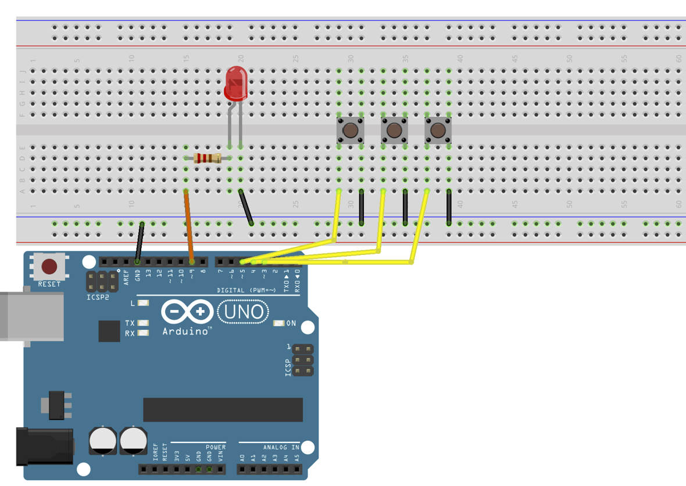

# ArduinoのLED点灯プログラム

このArduinoのプログラムは、3つのボタンを使ってLEDを点灯、明るさの調整、消灯を行うものです。

回路図
  

  


 
---

## プログラムの概要
* ボタン1が押された場合、LEDを点灯させる
* ボタン2が押された場合、LEDの明るさを徐々に上げる
* ボタン3が押された場合、LEDを消灯する

また、各ボタンの状態をシリアルモニタに表示します。

### プログラムのコード解説
1. 定数宣言
```cpp
int ledPin = 9;        // LEDピン
int button1 = 3;       // ボタン1ピン
int button2 = 4;       // ボタン2ピン
int button3 = 5;       // ボタン3ピン
double fadeAmount = 0.001;  // 明るさの増減量
```
* `ledPin` はLEDが接続されているピン番号です。
* `button1` から `button3` までの変数に、それぞれボタンが接続されているピン番号を代入します。
* `fadeAmount` は、明るさの増減量を制御するための定数です。

2. setup()
```cpp
void setup() {
  pinMode(ledPin, OUTPUT); // LEDのピンを出力モードに設定
  pinMode(button1, INPUT_PULLUP);// ボタン１のピンを入力モードに設定
  pinMode(button2, INPUT_PULLUP);// ボタン２のピンを入力モードに設定
  pinMode(button3, INPUT_PULLUP);// ボタン３のピンを入力モードに設定
  Serial.begin(9600);
}
```
* `pinMode()` を使って、各ピンの入出力を設定します。
* `INPUT_PULLUP` を使って、ボタンが接続されたピンの内部プルアップ抵抗を有効にします。
* `Serial.begin()` でシリアル通信を初期化します。

---
3. loop()
* メインループ。プログラムが実行される間、このループが繰り返されます。

```cpp
void loop() {
  // ボタン1が押された場合、LED光る
  if (digitalRead(button1) == LOW) {
    digitalWrite(ledPin, HIGH);
  }

  // ボタン2が押された場合、LEDの明るさを徐々に上げる
  if (digitalRead(button2) == LOW) {
    for (double i = 0; i <= 255; i += fadeAmount) {
      analogWrite(ledPin, i);
    }
  }
// ボタン3が押された場合、LEDを消す
if (digitalRead(button3) == LOW) {
  digitalWrite(ledPin, LOW);
}


// シリアルモニタに各ボタンの状態を表示する
Serial.print("Button 1: ");
Serial.print(digitalRead(button1));
Serial.print(" | Button 2: ");
Serial.print(digitalRead(button2));
Serial.print(" | Button 3: ");
Serial.print(digitalRead(button3));
}
```
---
中身の解説
```cpp
  if (digitalRead(button1) == LOW) {
    digitalWrite(ledPin, HIGH);
  }
```
このif文は、デジタルピンの状態を読み取り、button1が押されたかどうかを確認しています。

* `digitalRead()`関数は、指定されたピンの状態を読み取り、HIGHまたはLOWの値を返します。

この場合、button1ピンがLOWになった場合（つまり、押された場合）、LEDが点灯するように、`digitalWrite()`関数を使用してledPinをHIGHに設定しています。
ボタン３の処理はこれの反対でledPinをLOWに設定しています。
```cpp
  if (digitalRead(button2) == LOW) {
    for (double i = 0; i <= 255; i += fadeAmount) {
      analogWrite(ledPin, i);
    }
  }
```
* `digitalRead()` 関数は、引数で指定したピンの状態（HIGHまたはLOW）を読み取ります。ここでは、ボタン2が押されるとそのピンの状態はLOWになります。
* forループで使用する変数` i` は、0から255までfadeAmountずつ増加し、LEDの明るさを徐々に上げます
* `analogWrite()` 関数は、引数で指定したピンにPWM（パルス幅変調）信号を出力します。PWM信号は、HIGHとLOWの繰り返しで構成される信号で、HIGHとLOWの比率を変えることで平均的な電圧を制御します。ここでは、LEDの明るさを i に設定することで、PWM信号を出力してLEDの明るさを変化させています。

---
```cpp
Serial.print("Button 1: ");
Serial.print(digitalRead(button1));
Serial.print(" | Button 2: ");
Serial.print(digitalRead(button2));
Serial.print(" | Button 3: ");
Serial.print(digitalRead(button3));
```
シリアルモニタにボタン1から4までの各ボタンの状態を表示するものです。

`Serial.print()`は、指定したテキストや変数の値をシリアルモニタに出力します。`Serial.println()`は、指定したテキストや変数の値を出力し、改行を追加します。

具体的には、まず`"Button 1: "`のテキストが出力され、その後に`digitalRead(button1)`が実行され、`button1ピンの状態`が読み取られます。同様に、`"Button 2: "`のテキストと`button2ピンの状態`が出力され、`"Button 3: "`と`button3ピンの状態`が出力されます。

各ボタンの状態は、`digitalRead()`関数によって読み取られ、ピンの電圧レベルがHIGH（3.3Vまたは5V）かLOW（0V）かによって判断されます。`digitalRead()`関数は、指定されたピンの状態を返します。この値は、0または1の整数であり、LOWに対応する0、HIGHに対応する1となります。

---
### if文について
C言語のif文は、指定した条件に基づいて、プログラムの実行フローを分岐するために使用されます。
条件式が真の場合、if文のブロック内の文が実行されます。条件式が偽の場合、if文のブロック内の文はスキップされ、次の行が実行されます。

if文は以下のような構文を持ちます。
```cpp
if (条件式) {
  // 条件が真の場合に実行される文
}
```
ここで、`条件式`は、真偽値を評価する式であり、`{}`の中には、条件が真の場合に実行される一連の文が含まれます。また、中括弧は、複数の文をブロックとしてまとめるために使用されます。

if文は、条件式が複雑な場合に、比較演算子（`<`, `>`,` ==`など）や論理演算子（`&&`, `||`, `!`など）を組み合わせることができます。

また、if文は、条件式が偽の場合に実行される文を指定する、else節と組み合わせることができます。else節は、次のように記述されます
```cpp
if (条件式) {
  // 条件が真の場合に実行される文
} else {
  // 条件が偽の場合に実行される文
}
```

if文は、プログラムの制御フローを制御するために頻繁に使用される構文の一つです。

条件に応じて、プログラムの実行を変更したい場合に、if文を使用します。

---
### for文について

for文は、C言語において繰り返し処理を行うための構文の1つです。for文は、指定された回数または条件に従って、同じ処理を繰り返し実行することができます。
for文は以下のような構文を持ちます。
```cpp
for ( 初期化文 ; 条件式 ; 更新文 ) {
    繰り返し実行する処理
}
```
for文は、3つの部分で構成されています。
1. 初期化文：ループ変数の初期化を行います。この部分で変数を宣言し、初期値を代入します。
2. 条件式：繰り返し処理を行うための条件を指定します。この条件が真である限り、処理が繰り返し実行されます。
3. 更新文：ループ変数の更新を行います。この部分で変数に新しい値を代入します。

for文が実行されると、まず初期化文が実行されます。次に、条件式が評価され、その結果が真であれば、繰り返し実行する処理が実行されます。処理が実行された後、更新文が実行されます。そして再び条件式が評価され、その結果が真であれば、処理が実行されます。このサイクルが条件式が偽となるまで繰り返されます。


