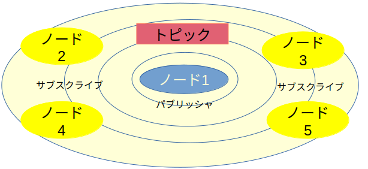
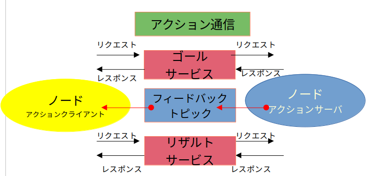
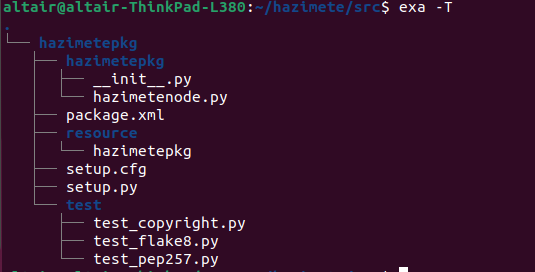
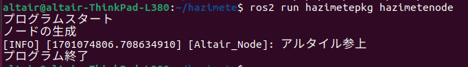
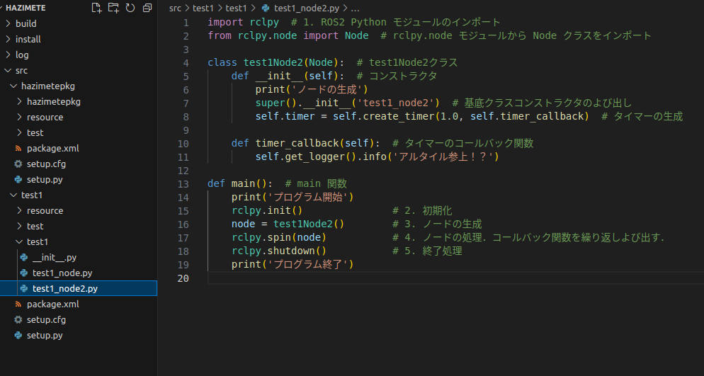
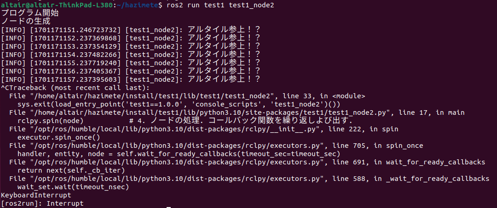

# ROS 2講習 第一回
### 4S 野口 史遠

参考文献:ROS2とPythonで作って学ぶAIロボット入門

---

## 環境
* python 3.10 
* ThinkPad L380 ubuntu22.04.3tls
* ROS2 humble
---
## ROS 2の基礎知識

ROS 2は多くの実行中のプログラム間で通信してロボットを動かす。このプログラムのことを`ノード(node)`という

つまりロボットを動かすにはROS 2の通信を理解しないといけない。


### 通信方法
ros2の通信方法には
`トピック通信` `サ−ビス通信` `アクション通信` `パラメーター通信`
の４つがある。

---

## 1. トピック（Topic）
### 概要
- １方向・非同期通信
### 用途
多くのノードに同じデータを送る場合
センサーデータの配信・受信
カメラ，LIDARとか

---


イメージ：テレビ
テレビ局に該当するデータの送り手を`パブリッシャ(pablisher)`
視聴者に該当する受け手を`サブスクライバ(subscriber)`という
番組のチャンネルが`トピック`といいデータを`メッセージ`と呼ぶ

---

## 2. サービス（Service）

### 概要
- 双方向・同期通信
### 用途
すぐに終了するタスク
電源の起動確認，モード切替
カメラ，LIDARなどのセンサーの動作モード切替

---


イメージ：Google検索
データの送り手を`クライアント（client）`
そのデータを処理して応答する側を`サーバ(server)`という．
クライアントからサーバに仕事を依頼することを`リクエスト`，そのデータを`リクエストメッセージ`，サーバが結果をクライアントに返すことを`レスポンス`，そのデータを`レスポンスメッセージ`と呼ぶ

---

## 3. アクション（Action）
### 概要
- 双方向・同期通信，サービス通信より高性能
### 用途
ナビゲーションなどタスク終了までに時間がかかり，途中経過も知りたい複雑なタスクのとき

---


サービスとトピックの両方を使用している

---

## 4. パラメータ（Parameter）
### 概要
- ノードの振る舞いを変えるパラメータ専用通信
### 用途
ロボットの動作などを実行中に変えたいとき


---
## コマンド

ROS１はLinux環境でしか使用できなかったため,ROS2もLinux文化の影響が強くGUIではなく，コマンドを使用するCUIアプリを使用することが一般的

## コマンドが使えないとROS２を使うことは非っ常にキビシー
ROS2ではコマンドとしてros2コマンドを使う
どんなのがあるか調べてみよう

```
ros2 --help
```
```
ros2 サブコマンド　--help
```
---

| サブコマンド | 内容                                                                                                         | 
| -------------- | --------------------------------------------------------------------------------------------------------- | 
| action       | アクション通信関連                                                                                           | 
| bag          | Rocbag関連.rosbagはセンサ情報を記録，再生する強力なツール                                                    | 
| launch       | ローチンファイルを実行．<br>ローチンファイルは複数ののーどやその設定などをまとめて起動するために使うファイル | 
| node         | ノード関連                                                                                                   | 
| pkg          | パッケージ関連                                                                                               | 
| run          | パッケージの実行可能ファイルを実行                                                                           | 
| service      | サービス通信関連                                                                                             | 
| topic        | トピック関連                                                                                                 | 

---
# 初めてのROS2プログラミング

プログラムの流れ
1. ワークスペースの作成：作業スペースを作る，パッケージはこの中に
2. パッケージの作成：ROS2はパッケージ単位でプログラムを作る
3. ソースコードの作成：ノードのソースコードを作る
4. ビルド：ノードの実行ファイルを作る
5. 設定ファイルの反映：ノードが実行できるように環境を整える
6. ノードの実行

---
# １.ワークスペースの作成
ROS2ではプログラムをパッケージと呼ばれる単位でつくります．はじめにパッケージを保存するための作業用ディレクトリを作らなければなりません．それがワークスペースです．１つのワークスペースに何個でもパッケージを作れます．
また，自作パッケージを使うにはROSシステムのワークスペース環境（`アンダーレイ`）と自作ワークスペース環境(`オーバーレイ`)を整えなければならない．

---
* 設定ファイルの実行
`source`コマンドでアンダーレイの設定ファイルを実行
```
source /opt/ros/humble/setup.bash
```

* ワークスペース用のディレクトリ作成
`mkdir`コマンドでディレクトリを作成
```
mkdir -p ~/hazimete/src
```
---
# 2.パッケージの作成
パッケージは自作したROS2コードの入れ物．パッケージを使うことでかんたんにビルでできたり一般公開できるようになる

ファイル構成
* setup.py:パッケージのインストール法が書かれたファイル
* setup.cfg:パッケージ実行ファイルがある場合に必要なファイル（ros2 run）
* package.xlm:パッケージに関する情報
* パッケージ名: パッケージと同じ名前のディレクトリ
---

* パッケージの作成
`cd`コマンドでディレクトリを移動する
```
cd ~/hazimete/src
```
つぎに`ros2 pkg create`コマンドでパッケージを作成
```
ros2 pkg create --build-type ament_python hazimetepkg
```
なお，
```
ros2 pkg create --build-type ament_python --node-name hazimetenode hazimetepkg
```
とするとノードも作れる．

---
# 3.ソースコードの作成
現在の中身



ここからは，使いやすいvscodeを使います
```
cd ~/hazimete
code .
```
とするとvscodeが立ち上がります．`.`はカントディレクトリ

---


---
* package.xlmの編集
コメントアウトが変更する場所
```xml
  <name>hazimetepkg</name> # 1.パッケージ名
  <version>0.0.0</version>　# 2.パッケージのバージョン
  <description>TODO: Package description</description> # 3.パッケージの説明
  <maintainer email="Altairu@github.com">altair</maintainer>　#4.保守者のメールアドレス
  <license>TODO: License declaration</license>　＃５．パッケージのライセンス
```
* setup.pyの編集
setup.pyを変更しないとノードを実行できません
コメントアウトしている７つを変更しなければならない．
一般公開しない場合は７つ目のみ要変更

---
```py
from setuptools import find_packages, setup

package_name = 'hazimetepkg' # 1.パッケージ名

setup(
    name=package_name,
    version='0.0.0', # 2.パッケージのバージョン
    packages=find_packages(exclude=['test']),
    data_files=[
        ('share/ament_index/resource_index/packages',
            ['resource/' + package_name]),
        ('share/' + package_name, ['package.xml']),
    ],
    install_requires=['setuptools'],
    zip_safe=True,
    maintainer='altair', #3.保守者
    maintainer_email='Altairu@github.com', #4.保守者のメールアドレス
    description='TODO: Package description', #5.パッケージの説明
    license='TODO: License declaration', #6．パッケージのライセンス
    tests_require=['pytest'], 
    entry_points={ #7.エントリポイント
        'console_scripts': [
            #ノード名=パッケージ名.ノード名:main
            'hazimetenode = hazimetepkg.hazimetenode:main'#pythonファイルごとに必要
        ],
    },
)

```
エントリポイントを自動生成したければ`--node-name`のオプションをつければよし

---
* ソースコード作成
本来ならここでソースコードを作るが自動生成されたものを使ってみましょう
hazimetenode.pyは自動生成されたプログラムです．
```py
def main():
    print('Hi from hazimetepkg.')
if __name__ == '__main__':
    main()
```
---
# 4.ビルド
パッケージを作るためにビルドしないといけない
ROS２ではビルドシステムとして`ament`を使い，ビルドコマンドとして`colcon`を使う
ちなみにワークスペース名直下のディレクトリしかビルドできない
```
cd ~/hazimete
colcon build
```
---
# 5. 設定ファイルの反映
パッケージののーどを実行する前に，ROS2の設定ファイルをsourceコマンドで反映させる
* アンダーレイ設定ファイルの反映
```
source /opt/ros/humble/setup.bash
```
* オーバーレイ設定ファイルの反映
自作ワークスペースの設定を反映させる．これで作成したワークスペースの場所がわかるようになりノードを実行できる
```
source ~/hazimete/install/setup.bash
```
---
# 6.ノードの実行
```
ros2 run hazimetepkg hazimetenode
```


---
# ROS2プログラムの処理の流れ
1. モジュールのインポート
* ROS2でpythonプログラムを作るには`rclpy`をインポートする必要がある．
2. 初期化
* `rclpy.init() `:ROS2通信のための初期化
3. ノードの作成
* nodeクラスのインスタンス化：Nodeクラスを継承してクラスを作り,そのインスタンスをさくせいすることでノードを作成する．
4. ノード処理
* `rclpy.spin()`:繰り返し処理可能　`rclpy.spin_once()`:処理を１回実行
5. 終了処理
* `rclpy.shutdown()`:終了処理します．

---
# ROS2プログラミング
ROS2では基本的にクラスを使ってプログラミングします．
test1_node.py
```py
import rclpy  # 1. ROS2 Python モジュールのインポート
from rclpy.node import Node  # rclpy.node モジュールから Node クラスをインポート


class test1Node(Node):  # test1Nodeクラス
    def __init__(self):
        print('ノードの生成')
        super().__init__('test1_node')  # 基底クラスコンストラクタのよび出し
        self.get_logger().info('アルタイル参上')  # 4. ノードの処理


def main():  # main 関数
    print('プログラム開始')
    rclpy.init()               # 2. 初期化
    node = test1Node()         # 3. ノードの生成
    rclpy.shutdown()           # 5. 終了処理
    print('プログラム終了')
```

---

* インポート (1-2行目): 1行目のrcipy は ROS2のPython モジュールなので必ずインポートしなければなりません、2行目はノードをつくるために必要でrclpy node モジュールから Node クラスをインポートします。この2行は常に必要です
* クラスの定義 (5~9行目): test1Nodeクラスを定義しています.コンストラクタの8行目で基底クラスNodeのコンストラクタを呼び出すことでノードを生成しています.引数test1_Nodeはノード名です。9行目のget_logger().info()はノードのメソッドでログ(log)情報(この例ではアルタイル参上)を端末に表示します．print文とは違い、端末だけでなくROS2のアプリrqt_console でも読むことができます
* main()関数(12~17行目): このプログラムは main()関数から実行されるので、main()関数が前節で説明したsetup.pyのエントリポイント(開始点)です
* relpy.init()(14行目):rclpy.init()でROS2通信を初期化します.ノードをつくる前に呼び出さなければいけません
* クラスのインスタンス化 (15行目): test1Nodeクラスのインスタンスnodeを生成しています.
* rclpy.shutdown() (16行目): relpy.shutdown() で終了処理をしています.

---
### １回目で作ったワークスペースに違う名前でパッケージを作ってみましょう
同じパッケージ名があるとビルドできないので気をつけましょう．


---

# コールバックを使ったプログラム
ROS2では`コールバック関数`や`コールバックメソッド`を多用してっプログラムを作る．
* コールバック関数：プログラム中で，呼び出し先の関数の実行中に実行されるように，あらかじめ指定しておく関数

→マウスで線を書くなどの処理を実装するとき
あるイベントが起きたときになにか処理させたい場合に使われる
ROS2では`spinOnce()`や`spin()`でコールバックを明示的に呼び出す必要がある．

---
### タイマを使ったコールバック
test1_node2.py
```py
import rclpy  # 1. ROS2 Python モジュールのインポート
from rclpy.node import Node  # rclpy.node モジュールから Node クラスをインポート

class test1Node2(Node):  # test1Node2クラス
    def __init__(self):  # コンストラクタ
        print('ノードの生成')
        super().__init__('test1_node2')  # 基底クラスコンストラクタのよび出し
        self.timer = self.create_timer(1.0, self.timer_callback)  # タイマーの生成

    def timer_callback(self):  # タイマーのコールバック関数
        self.get_logger().info('アルタイル参上！？')

def main():  # main 関数
    print('プログラム開始')
    rclpy.init()               # 2. 初期化
    node = test1Node2()        # 3. ノードの生成
    rclpy.spin(node)           # 4. ノードの処理．コールバック関数を繰り返しよび出す．
    rclpy.shutdown()           # 5. 終了処理
    print('プログラム終了')
```
---
* タイマの生成(8行目):タイマを使うためには，`create_timer(timer_period,callback)`を使う．１番目の引数は繰り返し間隔[s],２番目はコールバック
* コールバック(10~11行目):timer_callbackはタイマによって周期的に呼び出されるコールバック．ここでは「アルタイル参上!?」って表示させてるだけ
* rclpy.spin (17行目):spinで何度もコールバックを呼び出します．プログラムはここでブロックされます．
---

### ではノードを追加してみましょう

'test1_node = test1.test1_node:main', 'test1_node2 = test1.test1_node2:main'
steup.pyに加えるの忘れずに

---

```
ros2 run test1 test1_node2
```


Ctrl+Cで強制的にプログラムを終了させてください．

---
### 次回はトピック通信とサービス通信のプログラムの作り方