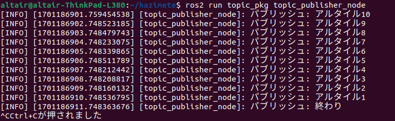
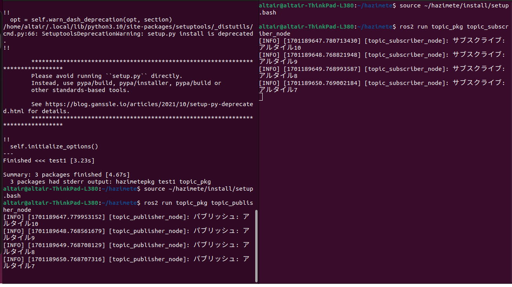

<br> 
<br> 
<br> 
<br> 
<br> 


# ROS 2講習 第二回
### 4S 野口 史遠
<br> 
<br> 
<br> 
<br> 
参考文献:ROS2とPythonで作って学ぶAIロボット入門

---

## 環境
* python 3.10 
* ThinkPad L380 ubuntu22.04.3tls
* ROS2 humble
---
# トピック通信プログラムの作り方
パブリッシャを使ったクラスの一般的な書き方
```py
class パブリッシャのクラスの名前(Node):  
    def __init__(self):  # コンストラクタ
        super().__init__('ノード名')
        self.pub = self.create_publisher(メッセージ型, トピック名, 通信品質)   
        # 1.パブリッシャの生成
        # メッセージ型：トピック通信に使うメッセージの型
        # トピック名：メッセージを送るトピック
        # 通信品質：通信品質に影響を及ぼすバッファの数
        self.timer = self.create_timer(タイマの間隔[s], コールバック)  
        # 2.タイマーの生成
        # 一定周期でパブリッシュする必要がなければタイマ不要
        # その他の必要な処理を書く

    def timer_callback(self):  # コールバック関数
        #メッセージに値を代入するなど
        #3.パブリッシュ
        self.pub.publish(メッセージ)
        #　メッセージをパブリッシュする
        # その他必要な処理を書く
```
---
## 注意点
### Pythonを使うときは型をあまり意識しないが，ROS2の通信ではメッセージ型を間違えると通信ができなくなる．
標準メッセージ型
bool,Char,Float32,Float64,Int8,Int16,Int32,Int64,String,MultiArray
 通信品質のバッファのデフォルトは１０


では新しくパッケージを作りましょう
```
cd ~/hazimete/src
ros2 pkg create --build-type ament_python --node-name topic_publisher_node topic_pkg
```

---

topic_publisher_node.py
```py
import rclpy                         # ROS2のPythonモジュール
from rclpy.node import Node          # rclpy.nodeモジュールからNodeクラスをインポート
from std_msgs.msg import String      # std_msgs.msgモジュールからStringクラスをインポート


class hazimetePublisher(Node):  # "Happy World"とパブリッシュ並びに表示するクラス
    def __init__(self):  # コンストラクタ
        super().__init__('topic_publisher_node')
        self.pub = self.create_publisher(String, 'topic', 10)   # パブリッシャの生成
        self.timer = self.create_timer(1, self.timer_callback)  # タイマーの生成
        self.i = 10

    def timer_callback(self):  # コールバック関数
        msg = String()
        if self.i > 0:
            msg.data = f'アルタイル{self.i}'
        else:
            msg.data = f"終わり"
            self.destroy_timer(self.timer)
        self.pub.publish(msg)
        self.get_logger().info(f'パブリッシュ: {msg.data}')
        self.i -= 1
```
mein()関数は前とほとんど同じ

---
* インポート(３行目):`create_publisher()`はパブリッシャを生成．
* コンストラクト(7~11行目):文字列は`f`文字列．self.iはカウント用

ログの重要度
DEBUG,INFO,WARN,ERROR,FATALとレベルが高くなる
標準設定の場合はINFO以上が表示される．ここではINFOを使っているのでログが端末に表示される．GUIツールrpt_consoleでも読める

---

実行
```
~/hazimete$ colcon build
~/hazimete$ source ~/hazimete/install/setup.bash
~/hazimete$ source /opt/ros/humble/setup.bash
~/hazimete$ ros2 run topic_pkg topic_publisher_node
```


---
# トピック通信プログラムの作り方
サブスクライバを使ったクラスの書き方
```py
class サブスクライバのクラス名(Node):
    def __init__(self):  # コンストラクタ
        super().__init__('ノード名')
        # 1.サブスクライバの生成
        self.sub = self.create_subscription(メッセージ型,
                                            トピック名, コールバック, 通信品質)
        # メッセージ型：トピック通信に使うメッセージの型
        # トピック名：メッセージを送るトピック
        # コールバック:サブスクライバが使うコールバック
        # 通信品質：通信品質に影響を及ぼすバッファの数
　　# 2.コールバックの定義
　　# 新しい通信が届くとrclpy.spin()がコールバック呼び出し
   # メッセージを引数として取得可能
    def callback(self, msg):  # コールバック関数
    　　# msgを使った処理
```
---
topic_subscriber_node.py
```py
import rclpy                         # ROS2のPythonモジュール
from rclpy.node import Node          # rclpy.nodeモジュールからNodeクラスをインポート
from std_msgs.msg import String      # std_msgs.msgモジュールからStringクラスをインポート


# Sring型メッセージをサブスクライブして端末に表示するだけの簡単なクラス
class hazimeteSubscriber(Node):
    def __init__(self):  # コンストラクタ
        super().__init__('topic_subscriber_node')
        # サブスクライバの生成
        self.sub = self.create_subscription(String,
                                            'topic', self.callback, 10)

    def callback(self, msg):  # コールバック関数
        self.get_logger().info(f'サブスクライブ: {msg.data}')
```
---
package.xmlの編集
topic_subscriber_node.pyでインポートしたモジュールを追加

```xml
                -
                -
                -
  <license>TODO: License declaration</license>
  
  <exec_depend>rclpy</exec_depend>
  <exec_depend>std_msgs</exec_depend>
  <exec_depend>geometry_msgs</exec_depend>

  <test_depend>ament_copyright</test_depend>
  <test_depend>ament_flake8</test_depend>
                -
                -
                -
```
---

setup.py
```py
    entry_points={
        'console_scripts': [
            'topic_publisher_node = topic_pkg.topic_publisher_node:main',
            'topic_subscriber_node =topic_pkg.topic_subscriber_node:main',
        ],
```
---
実行は端末をに分割して行う(先にサブスクライバを起動させておこう)


---

