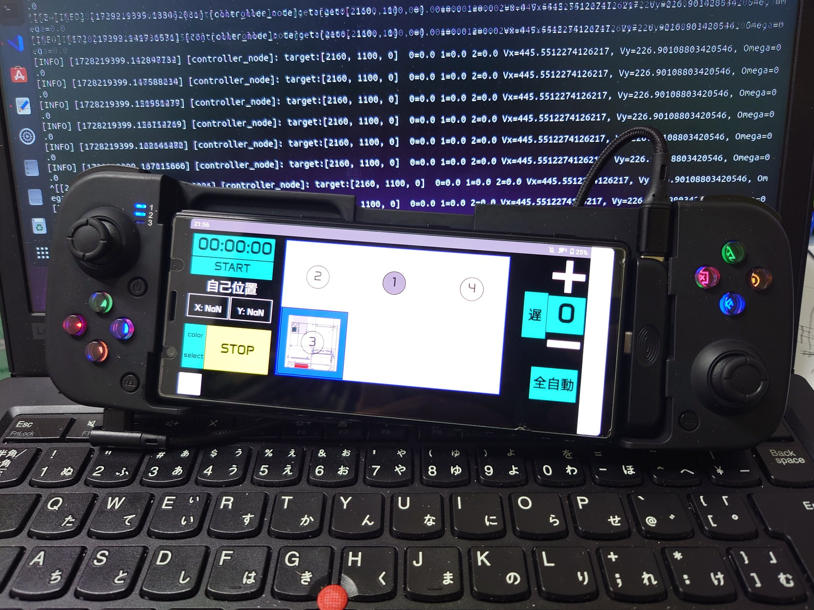

# ROS 2 高専ロボコン実践編

### 5S altair

## 環境

- Python 3.10
- ThinkPad L380 Ubuntu 22.04.3 LTS
- ROS2 Humble

# 初めに

まず，高専ロボコンにおける ROS2 の意義について説明する．

## ROS2 を使う理由

高専ロボコンのロボット開発では，以下の要素が求められる．

- **リアルタイム制御**：センサー情報を処理しながらロボットをスムーズに動作させる．
- **モジュール化**：複数の機能（モーター制御，画像処理，位置推定など）を分離し，開発しやすくする．
- **通信の簡素化**：各機能を担当するノード間でのデータのやり取りを簡潔にする．
- **拡張性**：機能追加がしやすい構造にする．

ROS2 は，これらの要素を満たすための優れたフレームワークである．

そこで 2024 年高専ロボコン A チームの Roboware を基に解説をしていく．

https://github.com/SkenHub/2024_A_ROS2_Roboware

# システム構築

## ROS2 を用いたシステムの全体構成

ROS2 を利用したロボコンのシステムでは，以下のような構成を取る．

- **通信層**：WebSocket を用いたスマートフォンとの通信
- **制御層**：ロボットの運動を計算し，適切な制御コマンドを生成
- **ハードウェア層**：シリアル通信を介してマイコンへ制御コマンドを送信
- **センシング層**：カメラや LiDAR を用いた環境認識と自己位置推定など

各層の役割を整理すると次のようになる．

| 層             | 役割                   | 具体的な処理例                         |
| -------------- | ---------------------- | -------------------------------------- |
| 通信層         | スマホ・PC との通信    | WebSocket を使用し，ユーザー入力を取得 |
| 制御層         | 経路計画・制御         | 位置推定を行いながら目標地点へ移動     |
| ハードウェア層 | モータードライバの制御 | 速度・角速度をシリアル通信で送信       |
| センシング層   | ロボットの自己位置推定 | RealSense T265 + マイコンのデータ統合  |

---

## 各ノードの役割

ROS2 の特徴として，機能ごとにノードを分割して管理できる．
以下に例を示す．

### 1. WebSocket 通信ノード (`web_socket_node`)

- **役割**：スマホコントローラーからの指示を受け取り，ROS2 トピックへ変換
- **使用技術**：FastAPI，WebSocket，ROS2 パブリッシャー

### 2. コントローラーノード (`controller_node`)

- **役割**：受け取った指示をもとに目標地点を計算し，適切な速度・方向・角速度を算出
- **重要な処理**：
  - 経路計画（現在位置 → 目標位置）
  - 速度制御（最大速度・加速度制限）
  - 方向制御（回転角度の計算）

### 3. シリアル送信ノード (`serial_send_node`)

- **役割**：計算された速度指示をシリアル通信でマイコンへ送信
- **通信フォーマット**：
  - `0xA5 0xA5 [指示番号] [モード] [Vx] [Vy] [omega]`
  - 115200 bps のシリアル通信で送信

### 4. シリアル受信ノード (`serial_read_node`)

- **役割**：マイコンからのフィードバック情報を取得し，自己位置データを ROS2 に公開
- **通信フォーマット**：
  - `0xA5 0xA5 [動作番号] [モード] [X] [Y] [θ]`
  - 115200 bps のシリアル通信で受信

### 5. 自己位置推定ノード (`position_node`)

- **役割**：
  - マイコンと RealSense T265 からの自己位置データを統合
  - 重み付き平均で誤差補正
  - `estimated_position` トピックを配信

# 通信層

高専ロボコンにおいてロボットに対して指令を送る際は遠隔操作を行わなければならない．
そこで通信モジュールとして ESP32，IM920 などが挙げられるが，これらには問題がある．

- **ESP32 の場合**
  - 2.4GHz 帯域で通信を行うため，混線の可能性が大きい．
  - 安定した通信を確保するには工夫が必要．
- **IM920 の場合**
  - 電波法の関係上，通信速度に制限がある（長距離通信向けであり、リアルタイム性が求められるロボコンには不向き）．

このため，WIFI を用いた通信を選択し，その実装として**WebSocket**を採用する．

### WebSocket のメリット

- **リアルタイム通信**：ロボットの操作に対し，低遅延で反応できる．
- **双方向通信**：ロボットの状態をスマートフォンに送信することも可，
- **軽量**：HTTP リクエストのように毎回ヘッダ情報を送る必要がないため，通信の負荷が軽い．

## FastAPI を利用した WebSocket サーバーの実装

WebSocket 通信を ROS2 と連携させるために**FastAPI**を使用する，FastAPI は軽量かつ高性能な Python の Web フレームワークであり，WebSocket を簡単に扱える．

### FastAPI の特徴

- **非同期処理（async/await）対応**
- **高速な通信処理（Starlette ベース）**
- **簡単な WebSocket 実装**

### WebSocket サーバーの基本実装（FastAPI）

以下のコードは，FastAPI を使用して WebSocket サーバーを作成し，クライアントとの通信を管理する．

#### **`web_socket_node.py`（通信ノード）**

```python
import threading
import rclpy
from rclpy.node import Node
from std_msgs.msg import String, Float32MultiArray
from fastapi import FastAPI, WebSocket as FastAPIWebSocket
from fastapi.responses import HTMLResponse
import uvicorn
import os

# IPアドレスとポート設定
IP_ADDRESS = '192.168.98.216'
PORT = 8010

# UIファイル（`R1_UI.txt`）のパス
UI_PATH = '/home/altair/2024_A_ROS2_Roboware/src/robot_controller/R1_UI.txt'

# FastAPIのインスタンスを作成
app = FastAPI()

# UIの読み込み
if not os.path.exists(UI_PATH):
    raise FileNotFoundError(f'File not found: {UI_PATH}')
with open(UI_PATH, 'r') as f:
    html = f.read()

class WebSocketNode(Node):
    def __init__(self):
        super().__init__('web_socket_node')
        self.send_data = ''
        self.pub = self.create_publisher(String, 'web_socket_pub', 10)
        self.sub = self.create_subscription(Float32MultiArray, 'estimated_position', self.callback, 10)

        @app.get("/")
        async def get():
            return HTMLResponse(html)

        @app.websocket('/ws')
        async def websocket_endpoint(websocket: FastAPIWebSocket):
            await websocket.accept()
            try:
                while True:
                    receive_data = await websocket.receive_text()
                    msg = String()
                    msg.data = receive_data
                    self.pub.publish(msg)

                    string_send_data = ",".join(map(str, self.send_data))
                    await websocket.send_text(string_send_data)
            except Exception as e:
                print(f'WebSocket error: {str(e)}')

    def callback(self, sub_msg):
        self.send_data = sub_msg.data

def run_ros2():
    rclpy.init()
    node = WebSocketNode()
    rclpy.spin(node)
    rclpy.shutdown()

def run_fastapi():
    uvicorn.run(app, host=IP_ADDRESS, port=PORT)

def main():
    ros2_thread = threading.Thread(target=run_ros2)
    ros2_thread.start()

    fastapi_thread = threading.Thread(target=run_fastapi)
    fastapi_thread.start()

    ros2_thread.join()
    fastapi_thread.join()

if __name__ == '__main__':
    main()
```

### WebSocket の利用例

1. クライアント（スマートフォン）から`ws://<PCのIP>:8000/ws`に接続．
2. JSON 形式のコマンドを送信.
3. WebSocket ノードが ROS2 のトピックにデータをパブリッシュ.
4. ROS2 ノードが処理し,ロボットを制御.
5. ロボットの自己位置データを WebSocket 経由でスマートフォンに送信.

## `R1_UI.txt`（UI ファイル）の作成方法

`R1_UI.txt` は Web ページの UI を記述した HTML ファイルです.このファイルはスマートフォンや PC のブラウザからアクセスし,ボタンやジョイスティックを操作することでロボットを制御するために使用します.

### **UI ファイルの基本構造**

UI は HTML + CSS で作成されており,主要な要素は以下の通りです.

例

```html
<!DOCTYPE html>
<html>
  <head>
    <meta charset="UTF-8" />
    <meta name="viewport" content="width=device-width, initial-scale=1.0" />
    <title>Robot Controller</title>
    <style>
      body {
        background: black;
        color: white;
        font-family: Arial, sans-serif;
        text-align: center;
      }

      .button {
        display: inline-block;
        width: 100px;
        height: 50px;
        margin: 10px;
        background-color: blue;
        color: white;
        font-size: 20px;
        border: none;
        cursor: pointer;
      }

      .button:hover {
        background-color: darkblue;
      }

      .joystick-container {
        position: absolute;
        bottom: 20px;
        left: 50%;
        transform: translateX(-50%);
      }
    </style>
  </head>
  <body>
    <h1>Robot Controller</h1>
    <button class="button" onclick="sendCommand('1')">Move 1</button>
    <button class="button" onclick="sendCommand('2')">Move 2</button>
    <button class="button" onclick="sendCommand('3')">Move 3</button>

    <div class="joystick-container">
      <input type="range" id="joystickX" min="0" max="200" value="100" />
      <input type="range" id="joystickY" min="0" max="200" value="100" />
      <button class="button" onclick="sendJoystick()">Send Joystick</button>
    </div>

    <script>
      const ws = new WebSocket("ws://192.168.98.216:8010/ws");

      ws.onmessage = function (event) {
        console.log("Received: " + event.data);
      };

      function sendCommand(command) {
        ws.send(command);
      }

      function sendJoystick() {
        let lx = document.getElementById("joystickX").value;
        let ly = document.getElementById("joystickY").value;
        let message = `0,1,0,0,0,0,0,${lx},${ly},100,100`;
        ws.send(message);
      }
    </script>
  </body>
</html>
```

### **UI ファイルの役割**

- **ボタン制御**：ボタンを押すと,特定の命令（例: `Move 1`）が WebSocket 経由で送信されます.
- **ジョイスティック制御**：スライダーで値を変更し,ジョイスティックの X,Y 値を送信することで,ロボットの移動を制御できます.

以下に堀君が作製したリポジトリを示す．詳しくは[こちら](https://github.com/SkenHub/ros2-websocket-link)を参照せよ．

# 制御層
ロボットを自律的に移動させるには，目標地点へ向かうだけでなく，安全かつスムーズに移動するための **経路計画** や **追従制御**，**PID制御** が必要になる．

本資料では，以下のトピックについて詳しく解説する

- **経路計画（現在位置 → 目標位置）**
- **追従制御（経路に対しての追従）**
  - 速度制御（最大速度・加速度制限）
  - 方向制御（回転角度の計算）
- **位置に対するPID制御**
一番実装が容易である．


## **経路計画**

### **障害物がない場合**

最も基本的な経路計画は，「現在位置から目標位置までの直線移動」 である．

#### **計算方法**

ロボットの現在位置を \((x_0, y_0)\)，目標位置を \((x_t, y_t)\) とすると，目標方向 \(\theta\) は以下の式で計算できる

$$
\theta = \tan^{-1}\left( \frac{y_t - y_0}{x_t - x_0} \right)
$$

移動距離 \(d\) は：

$$
d = \sqrt{(x_t - x_0)^2 + (y_t - y_0)^2}
$$

ロボットの速度 \(v\) は，最大速度 \(v_{max}\) を超えないように制限する：

$$
v = \min(v_{max}, d / t)
$$

ここで \(t\) は移動にかかる時間である．

#### **計算例**

現在位置：\((0, 0)\)，目標位置：\((1000, 500)\) のとき，

$$
\theta = \tan^{-1} \left( \frac{500}{1000} \right) = 26.57°
$$

$$
d = \sqrt{1000^2 + 500^2} = 1118.03 \text{ mm}
$$

### **障害物がある場合**

障害物がある場合，直線移動では衝突するため，障害物を避けながら目標地点へ移動する必要がある．そのための経路計画アルゴリズムとして以下がある

#### **① A**\*（A-star）アルゴリズム\*\*

A\*アルゴリズムは，グリッドマップ上で最短経路を求める代表的な探索アルゴリズムである．

- **手順**

  1. スタート地点から目標地点までのグリッドを生成する．
  2. 障害物のあるグリッドを無効にする．
  3. 各グリッドに対して，スタート地点からの移動コスト \(g\) と，ゴールまでの推定コスト \(h\) を計算し，評価関数 \(f = g + h\) を算出する．
  4. 最小の \(f\) を持つグリッドを選択し，ゴールに到達するまで繰り返す．

- **短所**：

  - 計算コストが高い
  - グリッドの解像度が低いと最適経路にならない

#### **② Dynamic Window Approach（DWA）**

DWAは，ロボットが障害物を回避しながらリアルタイムで動的に経路を生成する手法である．

- **手順**

  1. 現在のロボットの速度と角速度をもとに，次の動作候補（速度・角速度）を生成する．
  2. 各候補に対して，目標への到達度，障害物との距離，滑らかさを評価し，最適なものを選択する．
  3. これを繰り返しながら移動する．

- **短所**：

  - 事前にコスト関数のチューニングが必要
  - 近視的な判断をするため，大局的な最適経路にならないことがある

#### **③ 事前に決めた座標に向かって移動**

地図が既知の場合，事前に安全な中間座標を決めておき，その座標を順番に移動する方法がある．

- **手順**

  1. 事前に障害物を回避できる中間地点を定める（例：\(P_1, P_2, P_3\)）
  2. 現在位置から \(P_1\) に向かって移動する
  3. \(P_1\) に到達したら，次の目的地 \(P_2\) に移動する
  4. 最終目的地に到達するまで繰り返す

- **短所**：

  - 事前に環境を知っている必要がある
  - 障害物の変化に対応しづらい

## **位置に対するPID制御**

PID制御は，目標位置に対する偏差を最小化するために用いられる．

- **比例（P）制御**：位置の偏差に比例した制御入力を出力する
- **積分（I）制御**：過去の偏差を考慮して誤差を補正する
- **微分（D）制御**：未来の誤差変化を予測し，急激な変化を抑制する

PID制御の式：

$$
 u(t) = K_p e(t) + K_i \int e(t) dt + K_d \frac{de(t)}{dt}
$$

ここで，\(e(t)\) は現在の偏差，\(K_p, K_i, K_d\) はPIDゲインである．

PID制御は，障害物がない移動（直線移動）や，事前に決めた座標への移動に適用される．
以下に、位置制御に対するPID制御の実装例を示す。  
このPythonコードでは、現在のロボットの座標\((X, Y, \Theta)\) と目標座標を入力として、PID制御を適用し、速度\(V_x, V_y, \omega\) を出力する。

### **位置制御のためのPID制御（Python実装例）**
```python
import time
import math

class PIDController:
    def __init__(self, Kp, Ki, Kd, dt=0.1):
        """
        PID制御の初期化
        Kp: 比例ゲイン
        Ki: 積分ゲイン
        Kd: 微分ゲイン
        dt: 制御周期（秒）
        """
        self.Kp = Kp
        self.Ki = Ki
        self.Kd = Kd
        self.dt = dt

        self.prev_error = 0
        self.integral = 0

    def compute(self, error):
        """
        PID制御計算
        error: 現在の偏差
        """
        self.integral += error * self.dt
        derivative = (error - self.prev_error) / self.dt
        output = self.Kp * error + self.Ki * self.integral + self.Kd * derivative
        self.prev_error = error
        return output

class PositionPIDController:
    def __init__(self, Kp_linear, Ki_linear, Kd_linear, Kp_angular, Ki_angular, Kd_angular, dt=0.1):
        """
        位置制御のためのPID制御器
        Kp_linear, Ki_linear, Kd_linear: 並進方向（X, Y）のPIDゲイン
        Kp_angular, Ki_angular, Kd_angular: 角速度（ω）のPIDゲイン
        dt: 制御周期（秒）
        """
        self.pid_x = PIDController(Kp_linear, Ki_linear, Kd_linear, dt)
        self.pid_y = PIDController(Kp_linear, Ki_linear, Kd_linear, dt)
        self.pid_theta = PIDController(Kp_angular, Ki_angular, Kd_angular, dt)
        self.dt = dt

    def compute_control(self, current_pos, target_pos, max_speed=500, max_omega=30):
        """
        現在位置から目標位置への制御を計算
        current_pos: [x, y, theta] 現在の座標（mm, mm, deg）
        target_pos: [x, y, theta] 目標座標（mm, mm, deg）
        max_speed: 最大速度 [mm/s]
        max_omega: 最大角速度 [deg/s]
        """

        x_error = target_pos[0] - current_pos[0]
        y_error = target_pos[1] - current_pos[1]
        theta_error = (target_pos[2] - current_pos[2] + 360) % 360  # 目標角度との差分
        if theta_error > 180:
            theta_error -= 360  # -180 ~ 180 に正規化

        # PID制御による速度計算
        Vx = self.pid_x.compute(x_error)
        Vy = self.pid_y.compute(y_error)
        omega = self.pid_theta.compute(theta_error)

        # 最大速度制限
        speed = math.sqrt(Vx**2 + Vy**2)
        if speed > max_speed:
            scale = max_speed / speed
            Vx *= scale
            Vy *= scale

        # 最大角速度制限
        omega = max(-max_omega, min(max_omega, omega))

        return Vx, Vy, omega

# テスト用
if __name__ == "__main__":
    # PIDゲイン設定（適宜チューニング）
    Kp_linear = 0.5
    Ki_linear = 0.01
    Kd_linear = 0.1

    Kp_angular = 1.0
    Ki_angular = 0.01
    Kd_angular = 0.2

    controller = PositionPIDController(Kp_linear, Ki_linear, Kd_linear, Kp_angular, Ki_angular, Kd_angular)

    # 現在位置と目標位置
    current_position = [0, 0, 0]  # (X, Y, Theta)
    target_position = [1000, 500, 45]  # (X, Y, Theta)

    for _ in range(50):  # 50回更新
        Vx, Vy, omega = controller.compute_control(current_position, target_position)
        print(f"Vx: {Vx:.2f}, Vy: {Vy:.2f}, Omega: {omega:.2f}")

        # 仮のシミュレーション（現在位置を更新）
        current_position[0] += Vx * 0.1  # 0.1s ごとの移動
        current_position[1] += Vy * 0.1
        current_position[2] += omega * 0.1
        current_position[2] %= 360  # 角度を 0-360 に正規化

        time.sleep(0.1)
```

### **実装のポイント**
- **PID制御をX, Y, θ（角度）それぞれに適用**  
  - X, Y は並進方向の制御
  - θ はロボットの向きを制御する角速度

- **エラー（目標との差分）に対してPID計算を適用**
  - 直線移動時：\(V_x, V_y\) を調整して移動
  - 回転移動時：\(\omega\) を調整して向きを合わせる

- **速度制限の適用**
  - 平均速度が上限を超えないようにスケーリング
  - 角速度も最大値を設定して制限

### **計算例**
#### **初期状態**
- 現在位置：\((0,0,0)\)
- 目標位置：\((1000,500,45)\)

#### **実行後の出力例**
```py
Vx: 250.00, Vy: 125.00, Omega: 10.00
Vx: 200.00, Vy: 100.00, Omega: 8.00
Vx: 150.00, Vy: 75.00, Omega: 6.00
...
Vx: 0.00, Vy: 0.00, Omega: 0.00
```
このように、ロボットは目標地点に向かって減速しながら移動する.

## **実際のロボコンでは**
  
実際に使用したコードの解説を行う．

### **ControllerNode の解説**
 `ControllerNode` は，ロボットの移動制御を担当する ROS2 ノードである．  
WebSocket を通じて送信された指令を受け取り，ロボットの移動目標を決定し，適切な速度指令を送信する．  

### **ノードの概要**
| 項目 | 説明 |
|------|------|
| **ノード名** | `controller_node` |
| **購読トピック** | `web_socket_pub`（WebSocket からの指令），`estimated_position`（現在位置情報） |
| **発行トピック** | `cmd_vel`（速度指令を送信） |
| **機能** | 受信した指令に基づき，ロボットの移動目標を決定し，速度・角速度を計算して送信する |

### **初期化処理**

```python
class ControllerNode(Node):
    def __init__(self):
        super().__init__('controller_node')
```
`ControllerNode` クラスを ROS2 ノードとして初期化する．  
ROS2 のノードとして機能するために `super().__init__('controller_node')` を呼び出す．  

### **トピックの購読・発行**

```python
self.subscription = self.create_subscription(
    String,
    'web_socket_pub',
    self.listener_callback,
    10)

self.publisher_ = self.create_publisher(Float32MultiArray, 'cmd_vel', 10)

self.position_subscription = self.create_subscription(
    Float32MultiArray,
    'estimated_position',
    self.update_position_callback,
    10)
```
- `web_socket_pub` のデータを購読し，`listener_callback` 関数を実行する
- `cmd_vel` トピックを発行し，移動制御の指令を送信する
- `estimated_position` のデータを購読し，現在位置の更新を行う

### **目標地点の設定**

```python
self.locations_normal = {
    '1': [2160, 1100, 0],  
    '2': [0, 1100, 0],
    '3': [0, 0, 0],
    '4': [3000, 1500, 0],
    '5': [3000, 1500, 90]
}
self.locations_inverted = {
    '1': [-1480, 1100, 0],  
    '2': [0, 1100, 0],
    '3': [0, 0, 0],
    '4': [-3000, 1500, 0],
    '5': [0, 1500, 90]
}
```
モード `0`（通常モード）と `1`（X軸反転モード）で目標座標を切り替える．  
モード `1` では `X` 座標が負の値となり，左右対称の座標系となる．  

### **WebSocket からのデータ受信**

```python
def listener_callback(self, msg):
    data = msg.data.split(',')

    if len(data) < 13:
        self.get_logger().error(f"受信データの長さが不足しています: {len(data)}個の要素があり，最低でも13個が必要です")
        return

    behavior = int(data[0])
    mode = int(data[1])
    buttons = list(map(int, data[2:6]))
    color = data[6]
    emergency_stop = int(data[7])
    lx = int(data[8])
    ly = int(data[9])
    rx = int(data[10])
    ry = int(data[11])
    self.speedmode = int(data[12])
```
WebSocket から送信されるデータは，カンマ区切りの文字列となっている．  
各データを分割し，適切な型に変換して利用する．  

### **手動・自動モードの切り替え**

```python
if emergency_stop == 1:
    self.send_velocity_command(0.0, 0.0, 0.0, mode, float(255))
    return

elif mode == 1:
    if not behavior == 21:
        if self.speedmode == 0:
            self.nx = 7
            self.ny = 7
        else:
            self.nx = 2
            self.ny = 50
        Vx = (rx-105) * self.nx
        Vy = (ry-107) * self.ny
        omega = (lx-102) / 2
        self.send_velocity_command(Vx, Vy, omega, mode, behavior)
    else:
        self.send_velocity_command(0, 0, 0, mode, behavior)
```
- 非常停止 `emergency_stop` が `1` の場合は停止コマンドを送信
- `mode == 1` の場合，ジョイスティックでの手動操作
  - `speedmode == 0`（低速モード）と `1`（高速モード）で速度スケールを変更
  - ジョイスティックの値を `Vx, Vy, omega` に変換し送信

### **目標地点への移動（経路計画）**

```python
if any(buttons):
    for i, button in enumerate(buttons):
        if button == 1:
            if color == '0':
                target = self.locations_normal[str(i + 1)]
            else:
                target = self.locations_inverted[str(i + 1)]
            self.move_to_target(target, float(mode), float(0))
            break
```
- どのボタンが押されたかをチェックし，対応する目標地点 `target` を取得
- `move_to_target(target, mode, 0)` を呼び出し，目標地点に向けて移動を開始

### **目標地点への移動の計算**

```python
def move_to_target(self, target, team_color, action_number):
    if self.speedmode == 0:
        self.max_speed = 500
        self.max_accel = 500
    else:
        self.max_speed = 800
        self.max_accel = 800

    x, y, target_theta = target
    dx = x - self.current_position[0]
    dy = y - self.current_position[1]
    distance = math.sqrt(dx**2 + dy**2)
    direction = (math.degrees(math.atan2(dy, dx)) - 90) % 360
```
- `dx, dy` を計算し，目標地点までの距離と方向を算出
- 方向 `direction` は `atan2(dy, dx)` を使用して求め，90°ずらしている（正面が 0° になるよう調整）

### **速度制御**

```python
current_speed = math.sqrt(self.current_position[0]**2 + self.current_position[1]**2)
Vx = min(self.max_speed, distance) * math.sin(math.radians(direction))*-1
Vy = min(self.max_speed, distance) * math.cos(math.radians(direction))
```
- 現在速度 `current_speed` を計算
- `Vx, Vy` を計算し，移動方向と速度を決定
- 最大速度 `max_speed` を超えないよう制限する

### **角度制御**

```python
dtheta = (target_theta - self.current_position[2] + 360) % 360
if dtheta > 180:
    dtheta -= 360
omega = max(min(dtheta, self.max_angular_speed), -self.max_angular_speed)
```
- 目標角度 `target_theta` に向かうための角度偏差 `dtheta` を計算
- 180°を超えた場合は逆回転を行う
- 角速度 `omega` は `max_angular_speed` を超えないよう制限

### **速度指令の送信**

```python
def send_velocity_command(self, Vx, Vy, omega, team_color, action_number):
    msg = Float32MultiArray()
    msg.data = [float(Vx), float(Vy), float(omega), float(team_color), float(action_number)]
    self.publisher_.publish(msg)
```
- `cmd_vel` トピックに移動指令を送信

# ハードウェア層
### **ハードウェア層：シリアル通信を用いたマイコンとの連携**
ロボットを制御するためには，PC（ROS2）とマイコン（STM32など）が通信し，指令を送受信する必要がある．  
高専ロボコンにおいては，リアルタイム性と安定したデータ通信が求められるため，**シリアル通信（UART）** を用いることが一般的である．
シリアル通信とは，データを 1 ビットずつ順番に送受信する通信方式であり，**UART（Universal Asynchronous Receiver Transmitter）** で広く使用される．  

### **送受信の通信フォーマット**
本システムでは，PC（ROS2）からマイコンへ指令を送り，マイコンからPCへロボットの状態を報告する．

| データ方向 | フォーマット |
|-----------|------------|
| **PC → マイコン** | `[0xA5, 0xA5, 指示番号, モード, Vx, Vy, ω]` |
| **マイコン → PC** | `[0xA5, 0xA5, 動作番号, モード, X, Y, θ]` |

- **`0xA5, 0xA5`**: ヘッダー（データの開始を示す）
- **`指示番号`**: PC から送信する命令番号（1～20）
- **`動作番号`**: マイコンの現在の動作状態
- **`モード`**: 0（自動制御），1（手動制御）
- **`Vx, Vy, ω`**: ロボットの並進速度・回転速度（単位 mm/s, deg/s）
- **`X, Y, θ`**: マイコンからの自己位置データ（単位 mm, 度）

通信フォーマットは固定長（9バイト）にすることで，データ受信の安定性を確保する．

## **シリアル通信の実装**
### **(1) PC からマイコンへデータ送信**
ROS2 の `serial_send_node` からマイコンへデータを送る．

#### **Python によるシリアル通信の実装（送信側）**
```python
import serial
import struct

# シリアルポート設定
ser = serial.Serial('/dev/ttyACM0', 115200, timeout=1)

HEADER = b'\xA5\xA5'

def send_data_to_mcu(command_number, mode, Vx, Vy, omega):
    """MDD0にデータを送信する関数"""
    # 速度の範囲制限（符号付き16ビット整数）
    Vx = max(-32768, min(32767, Vx))
    Vy = max(-32768, min(32767, Vy))
    omega = max(-32768, min(32767, omega))
    
    # データをパック
    data = struct.pack('>BBhhh', command_number, mode, Vx, Vy, omega)
    packet = HEADER + data
    
    # 送信
    ser.write(packet)

# 例: 指示番号=1, モード=0, Vx=500, Vy=0, ω=10
send_data_to_mcu(1, 0, 500, 0, 10)
```
### **(2) マイコンから PC へデータ受信**
#### **Python によるシリアル通信の実装（受信側）**
```python
def receive_data_from_mcu():
    """MDD0からデータを受信する関数"""
    buffer = b''
    
    while ser.in_waiting > 0:
        buffer += ser.read(1)

        if len(buffer) >= 2 and buffer[-2:] == HEADER:
            data = ser.read(8)
            if len(data) == 8:
                action_number, mode, X, Y, theta = struct.unpack('>BBhhh', data)
                print(f"Received: Action={action_number}, Mode={mode}, X={X}, Y={Y}, Theta={theta}")
            else:
                print("Received data length mismatch")
            buffer = b''
        elif len(buffer) > 2:
            buffer = buffer[-2:]

receive_data_from_mcu()
```
- **`while ser.in_waiting > 0`**: 受信バッファにデータがある間，データを読み込む
- **`if len(buffer) >= 2 and buffer[-2:] == HEADER:`**: ヘッダーが一致したらデータを受信
- **`struct.unpack('>BBhhh', data)`**: バイナリデータを解析し，値を取得

## **ROS2 ノードとしての実装**
### **シリアル通信ノードの構成**
| ノード名 | 機能 |
|---------|------|
| `serial_send_node` | PC → マイコンの指令送信 |
| `serial_read_node` | マイコン → PC のデータ受信 |

### **`serial_send_node`（PC → マイコン）**
```python
import rclpy
from rclpy.node import Node
from std_msgs.msg import Float32MultiArray
import serial
import struct

class SerialSendNode(Node):
    def __init__(self):
        super().__init__('serial_send_node')
        self.subscription = self.create_subscription(
            Float32MultiArray,
            'cmd_vel',
            self.listener_callback,
            10)
        self.ser = serial.Serial('/dev/ttyACM0', 115200, timeout=1)

    def listener_callback(self, msg):
        command_number = int(msg.data[4])
        mode = int(msg.data[3])
        Vx = int(msg.data[0])
        Vy = int(msg.data[1])
        omega = int(msg.data[2])

        # データ送信
        self.send_data(command_number, mode, Vx, Vy, omega)

    def send_data(self, command_number, mode, Vx, Vy, omega):
        HEADER = b'\xA5\xA5'
        data = struct.pack('>BBhhh', command_number, mode, Vx, Vy, omega)
        self.ser.write(HEADER + data)

def main(args=None):
    rclpy.init(args=args)
    node = SerialSendNode()
    rclpy.spin(node)
    node.destroy_node()
    rclpy.shutdown()

if __name__ == '__main__':
    main()
```
- `cmd_vel` トピックを購読し，マイコンへシリアル通信で送信
- `send_data` 関数でバイナリデータに変換して送信

### **`serial_read_node`（マイコン → PC）**
```python
class SerialReadNode(Node):
    def __init__(self):
        super().__init__('serial_read_node')
        self.publisher_ = self.create_publisher(Float32MultiArray, 'robot_position', 10)
        self.ser = serial.Serial('/dev/ttyACM0', 115200, timeout=1)
        self.create_timer(0.05, self.read_serial_data)

    def read_serial_data(self):
        buffer = b''
        while self.ser.in_waiting > 0:
            buffer += self.ser.read(1)

            if len(buffer) >= 2 and buffer[-2:] == b'\xA5\xA5':
                data = self.ser.read(8)
                if len(data) == 8:
                    action_number, mode, X, Y, theta = struct.unpack('>BBhhh', data)
                    msg = Float32MultiArray()
                    msg.data = [float(X), float(Y), float(theta)]
                    self.publisher_.publish(msg)
                buffer = b''

def main(args=None):
    rclpy.init(args=args)
    node = SerialReadNode()
    rclpy.spin(node)
    node.destroy_node()
    rclpy.shutdown()
```
- `robot_position` トピックを発行し，受信した座標を送信
- `read_serial_data` でシリアル通信を監視し，マイコンのデータを取得

# センシング層

ロボットの自律移動には，周囲の環境を認識し，自己位置を正確に推定することが不可欠である．  
本章では，**RealSenseセンサ（T265, D435i）を用いた自己位置推定** や **YOLOを用いた物体認識** について解説する．  
さらに，**ローパスフィルタ，重み付き平均，カルマンフィルタ** を用いたデータ処理手法についても説明する．


## **RealSenseセンサを用いた自己位置推定**
Intel RealSenseは，ステレオカメラやIMUを活用し，**奥行き情報や自己位置の推定** を可能にするセンサである．  
たとえば，**T265** を使って自己位置を推定し，**D435i** を使って障害物や人物を検出する．

### **RealSense T265（VSLAMを用いた自己位置推定）**
T265は**Visual SLAM（VSLAM）** を用いて自己位置を推定するカメラである．  
IMU（慣性計測装置）と2つの魚眼カメラを組み合わせ，外部のランドマークなしで自己位置を求めることができる．

#### **自己位置推定の計算**
自己位置は，カメラのIMUデータとVSLAMを統合して得られる．座標系は以下のように定義される：

- \( x \) 軸：ロボットの右方向（m）
- \( y \) 軸：ロボットの前方向（m）
- \( \theta \) ：ロボットの回転角度（度）

移動距離 \( d \) は，前回の位置 \((x_0, y_0)\) と現在位置 \((x_t, y_t)\) から次のように計算される：

$$
d = \sqrt{(x_t - x_0)^2 + (y_t - y_0)^2}
$$

ロボットの進行方向 \(\theta\) は：

$$
\theta = \tan^{-1} \left( \frac{y_t - y_0}{x_t - x_0} \right)
$$

#### **ROS2 ノード実装（自己位置推定）**
```python
import rclpy
from rclpy.node import Node
from std_msgs.msg import Float32MultiArray
import pyrealsense2 as rs

class RealSensePositionNode(Node):
    def __init__(self):
        super().__init__('realsense_position_node')
        self.publisher_ = self.create_publisher(Float32MultiArray, 'realsense_position', 10)

        self.pipe = rs.pipeline()
        cfg = rs.config()
        cfg.enable_stream(rs.stream.pose)  # IMUとVSLAMによる自己位置推定
        self.pipe.start(cfg)

        self.create_timer(0.1, self.update_position)

    def update_position(self):
        frames = self.pipe.wait_for_frames()
        pose = frames.get_pose_frame()
        if pose:
            data = pose.get_pose_data()
            x, y, theta = data.translation.x * 1000, data.translation.y * 1000, data.rotation.yaw
            msg = Float32MultiArray()
            msg.data = [x, y, theta]
            self.publisher_.publish(msg)
            self.get_logger().info(f"RealSense Position: X={x}, Y={y}, Theta={theta}")

    def destroy_node(self):
        self.pipe.stop()
        super().destroy_node()

def main(args=None):
    rclpy.init(args=args)
    node = RealSensePositionNode()
    rclpy.spin(node)
    node.destroy_node()
    rclpy.shutdown()

if __name__ == '__main__':
    main()
```
### **RealSense D435i（深度カメラを用いた障害物検出）**
D435iは，**ステレオカメラを用いた深度測定** と **IMUを利用した動き補正** が可能なカメラである．  
これを利用して，障害物の有無や人物の検出を行う．

#### **ROS2 ノード実装（深度データ取得）**
```python
import pyrealsense2 as rs
import numpy as np
import cv2

pipeline = rs.pipeline()
config = rs.config()
config.enable_stream(rs.stream.depth, 640, 480, rs.format.z16, 30)
config.enable_stream(rs.stream.color, 640, 480, rs.format.bgr8, 30)
pipeline.start(config)

while True:
    frames = pipeline.wait_for_frames()
    depth_frame = frames.get_depth_frame()
    color_frame = frames.get_color_frame()
    depth_image = np.asanyarray(depth_frame.get_data())
    color_image = np.asanyarray(color_frame.get_data())

    # 奥行きデータの取得
    center_x, center_y = 320, 240
    distance = depth_frame.get_distance(center_x, center_y)
    print(f"Distance to center: {distance:.2f}m")

    cv2.imshow("Depth Image", depth_image)
    cv2.imshow("Color Image", color_image)
    if cv2.waitKey(1) & 0xFF == ord('q'):
        break

pipeline.stop()
cv2.destroyAllWindows()
```
## **YOLO を用いた物体認識**
物体認識には **YOLO（You Only Look Once）** を使用する．  
YOLO は高速かつ高精度なリアルタイム物体検出が可能であり，ロボットが人や障害物を認識するために利用する．

#### **ROS2 ノード実装例**
```python
import torch
import cv2

# YOLOモデルをロード
model = torch.hub.load('/home/altair/Roboware/ultralytics/yolov5', 'custom',
                       path='/home/altair/Roboware/ultralytics/yolov5/yolov5s.pt', source='local')

# 画像を読み込み
img = cv2.imread("test.jpg")

# 物体検出を実行
results = model(img)

# 結果を表示
results.show()
```

## **データ処理手法**
センサデータのノイズを減らし，より安定した値を得るために，以下の手法を用いる．

### **ローパスフィルタ**
ノイズを除去し，急激な変化を抑えるフィルタ．  
フィルタ適用後のデータ \( X_f \) は以下の式で求められる：

$$
X_f = \alpha X + (1 - \alpha) X_{prev}
$$

Python 実装：
```python
alpha = 0.2
filtered_value = alpha * new_value + (1 - alpha) * previous_value
```

---

### **重み付き平均**
RealSenseとマイコンの自己位置データを統合する方法．  
重み \( w_r, w_m \) を用いて，統合した自己位置 \( X \) を求める：

$$
X = \frac{w_r X_r + w_m X_m}{w_r + w_m}
$$

Python 実装：
```python
w_r = 0.6
w_m = 0.4
fused_x = (w_r * realsense_x + w_m * microcontroller_x) / (w_r + w_m)
```

### **カルマンフィルタ**
ノイズ除去と予測補正を行う高度な手法．  
観測値 \( z \) と予測値 \( \hat{x} \) を組み合わせ，最適な値を求める：

$$
x_{new} = x_{prev} + K (z - x_{prev})
$$

Python 実装：
```python
K = 0.5  # カルマンゲイン
filtered_x = prev_x + K * (measured_x - prev_x)
```

# まとめ


| 層             | 役割                   | 具体的な処理例                         |
| -------------- | ---------------------- | -------------------------------------- |
| 通信層         | スマホ・PC との通信    | WebSocket を使用し，ユーザー入力を取得 |
| 制御層         | 経路計画・制御         | 位置推定を行いながら目標地点へ移動     |
| ハードウェア層 | 通信 | 速度・角速度をシリアル通信で送信       |
| センシング層   | ロボットの自己位置推定 | RealSense T265 + マイコンのデータ統合  |

実際にロボコンで使用された例を基に解説を行った．

次の資料ではこれらを基に簡易的なロボットのRobowareパッケージを構築していく．
