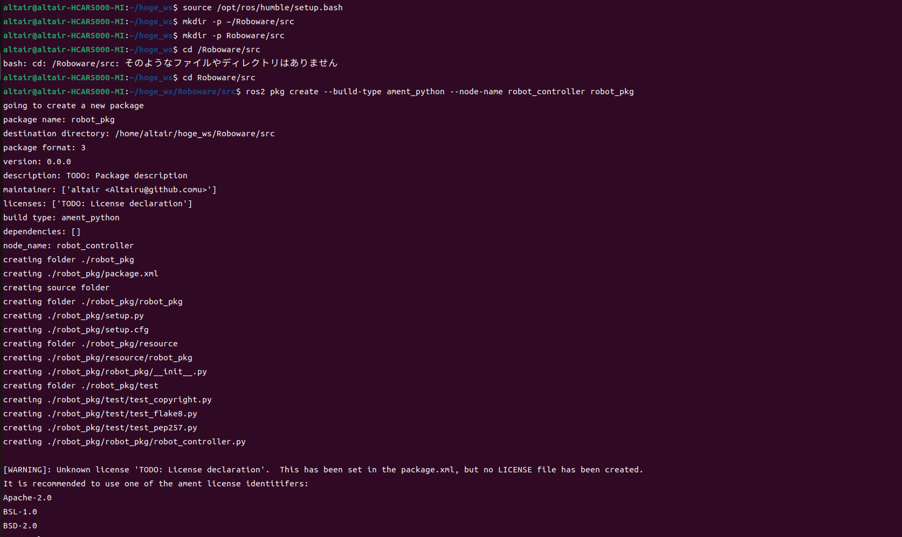
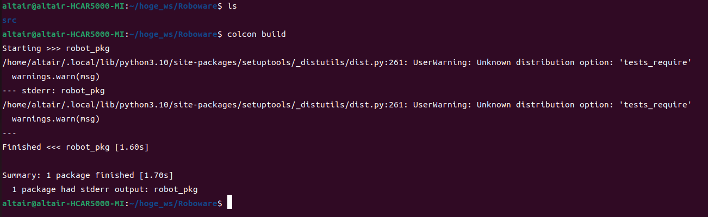
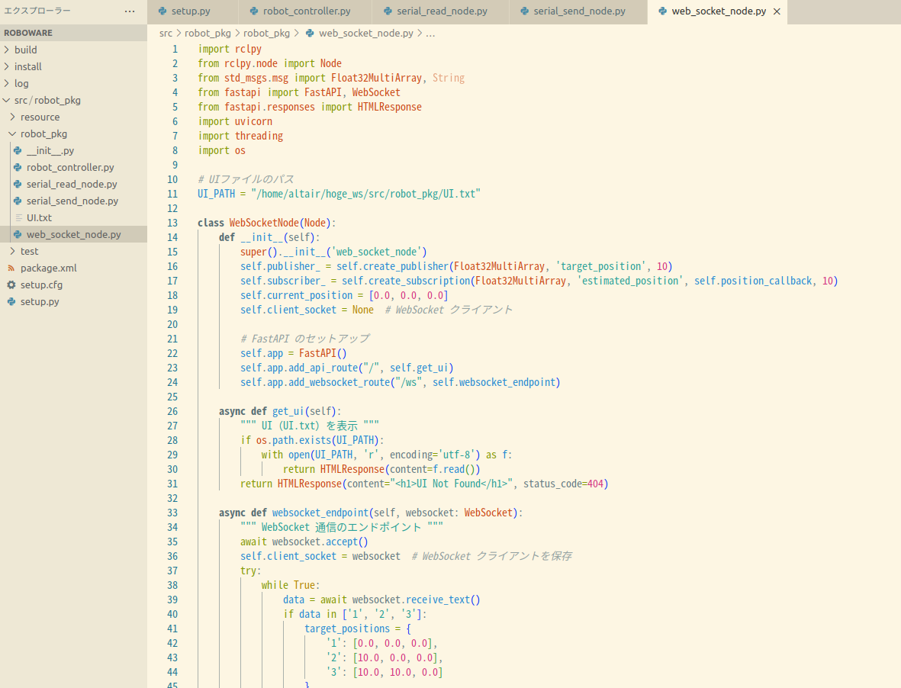
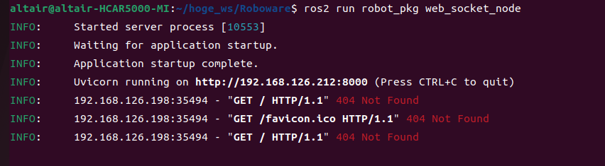

# ROS 2 高専ロボコン実践編-その2-
### 5S altair
## 環境

- Python 3.10
- ThinkPad L380 Ubuntu 22.04.3 LTS
- ROS2 Humble

> ⚠️この資料は結構手を抜いて作っています．⚠️


## **ROS2パッケージの構築**

ここでは，ROS2を用いたロボコン向けのシステムを実際に構築していく．  
以下のように**通信層，制御層，ハードウェア層** の3つに分け，それぞれの役割を明確にする．

| **層**             | **役割**           | **具体的な処理**                   |
| ------------------ | ------------------ | ---------------------------------- |
| **通信層**         | スマホ・PCとの通信 | WebSocket を使用                   |
| **制御層**         | 経路計画・制御     | 目標地点まで移動                   |
| **ハードウェア層** | 通信処理           | 自己位置を受け取り，Vx,Vy，ωを送信 |

```
│   ├── web_socket_node.py  # 通信ノード
│   ├── controller_node.py   # 制御ノード
│   ├── serial_read_node.py  # シリアル受信ノード
│   ├── serial_send_node.py  # シリアル送信ノード
```

# プログラミング

* 設定ファイルの実行
`source`コマンドでアンダーレイの設定ファイルを実行
```
source /opt/ros/humble/setup.bash
```

* ワークスペース用のディレクトリ作成
`mkdir`コマンドでディレクトリを作成
```
mkdir -p ~/Roboware/src
```
ここで `-p` オプションは，親ディレクトリが存在しない場合に自動で作成するオプションである．  
作成された `Roboware` ディレクトリが**ワークスペース** となり，その中の `src` にパッケージを作成する．

* パッケージの作成
`cd`コマンドでディレクトリを移動する
```
cd ~/Roboware/src
```
つぎに`ros2 pkg create`コマンドでパッケージを作成
```
ros2 pkg create --build-type ament_python --node-name robot_controller robot_pkg
```

>**ノードとパッケージの命名**

| **項目**                         | **ルール**              | **理由**                             |
| -------------------------------- | ----------------------- | ------------------------------------ |
| **小文字のみ**                   | `robot_controller` ✅    | ROS2 の命名規則に統一                |
| **単語はアンダースコアで区切る** | `serial_read_node` ✅    | 読みやすくするため                   |
| **役割を明確にする**             | `position_estimation` ✅ | 何をするノードなのか分かりやすくする |
| **一意の名前にする**             | `robot1_controller` ✅   | 名前の競合を防ぐ                     |
| **汎用的な名前を避ける**         | `custom_navigation` ✅   | 標準パッケージとの衝突を避ける       |



### **ワークスペースの初期化**
```bash
cd ~/Roboware
colcon build
```
これでワークスペースがROS2用にセットアップされる．



ビルドできたことがわかる．
ではVScodeで開いてみよう．

```bash
code .
```


## **システム概要**
### **ノードの構成**
| ノード名                | 役割                                                           |
| ----------------------- | -------------------------------------------------------------- |
| **web_socket_node.py**  | スマホと通信し，目標座標を受信                                 |
| **robot_controller.py** | 受信した目標座標に基づいて，速度 \( V_x, V_y, \omega \) を計算 |
| **serial_read_node.py** | マイコンからの自己位置データを受信                             |
| **serial_send_node.py** | 計算された速度指令をマイコンへ送信                             |


以下をセットアップファイルに記述すること
```py
'console_scripts': [
            'web_socket_node = robot_pkg.web_socket_node:main',
            'robot_controller = robot_pkg.robot_controller:main',
            'serial_read_node = robot_pkg.serial_read_node:main',
            'serial_send_node = robot_pkg.serial_send_node:main',
        ],
```


## **ノードの作成**
### **web_socket_node.py（通信ノード）**
スマホから **目標座標（座標1，座標2，座標3）** を受信し，ROS2トピック `target_position` にパブリッシュする．

#### **📌 やること**
- WebSocket サーバーを立ち上げる（FastAPI）
- スマホから目標座標を受信し，ROS2 にパブリッシュする

#### **📝 コード**
```python
import rclpy
from rclpy.node import Node
from std_msgs.msg import Float32MultiArray, String
from fastapi import FastAPI, WebSocket
from fastapi.responses import HTMLResponse
import uvicorn
import threading
import os

# UIファイルのパス
UI_PATH = "/home/altair/hoge_ws/src/robot_pkg/UI.txt"

class WebSocketNode(Node):
    def __init__(self):
        super().__init__('web_socket_node')
        self.publisher_ = self.create_publisher(Float32MultiArray, 'target_position', 10)
        self.subscriber_ = self.create_subscription(Float32MultiArray, 'estimated_position', self.position_callback, 10)
        self.current_position = [0.0, 0.0, 0.0]
        self.client_socket = None  # WebSocket クライアント

        # FastAPI のセットアップ
        self.app = FastAPI()
        self.app.add_api_route("/", self.get_ui)
        self.app.add_websocket_route("/ws", self.websocket_endpoint)

    async def get_ui(self):
        """ UI（UI.txt）を表示 """
        if os.path.exists(UI_PATH):
            with open(UI_PATH, 'r', encoding='utf-8') as f:
                return HTMLResponse(content=f.read())
        return HTMLResponse(content="<h1>UI Not Found</h1>", status_code=404)

    async def websocket_endpoint(self, websocket: WebSocket):
        """ WebSocket 通信のエンドポイント """
        await websocket.accept()
        self.client_socket = websocket  # WebSocket クライアントを保存
        try:
            while True:
                data = await websocket.receive_text()
                if data in ['1', '2', '3']:
                    target_positions = {
                        '1': [0.0, 0.0, 0.0],
                        '2': [10.0, 0.0, 0.0],
                        '3': [10.0, 10.0, 0.0]
                    }
                    msg = Float32MultiArray()
                    msg.data = target_positions[data]
                    self.publisher_.publish(msg)
                    self.get_logger().info(f"Published Target Position: {msg.data}")

                # 送信データをそのままクライアントに返す（デバッグ用）
                await websocket.send_text(f"Received: {data}")

        except Exception as e:
            self.get_logger().error(f"WebSocket Error: {e}")
        finally:
            self.client_socket = None  # 切断時にクライアントをリセット

    def position_callback(self, msg):
        self.current_position = msg.data
        if self.client_socket:
            position_data = ",".join(map(str, self.current_position))
            try:
                self.client_socket.send_text(position_data)
            except:
                self.client_socket = None

def ros2_thread(node):
    rclpy.spin(node)

def main():
    rclpy.init()
    node = WebSocketNode()
    
    # ROS2 ノードを別スレッドで実行
    ros_thread = threading.Thread(target=ros2_thread, args=(node,))
    ros_thread.start()

    # FastAPI サーバーを起動
    uvicorn.run(node.app, host="0.0.0.0", port=8000)

if __name__ == '__main__':
    main()

```

UIの例
```html
<!DOCTYPE html>
<html lang="ja">
<head>
    <meta charset="UTF-8">
    <meta name="viewport" content="width=device-width, initial-scale=1.0">
    <title>ロボット制御UI</title>
    <style>
        body {
            font-family: Arial, sans-serif;
            text-align: center;
            background-color: #f4f4f4;
        }
        .button {
            width: 150px;
            height: 50px;
            margin: 10px;
            font-size: 18px;
            cursor: pointer;
        }
        .status {
            font-size: 20px;
            margin-top: 20px;
        }
    </style>
</head>
<body>

    <h2>ロボット制御UI</h2>

    <!-- 座標選択ボタン -->
    <button class="button" onclick="sendCommand(1)">座標1</button>
    <button class="button" onclick="sendCommand(2)">座標2</button>
    <button class="button" onclick="sendCommand(3)">座標3</button>

    <script>
        const ws = new WebSocket("ws://192.168.98.216:8010/ws");

        ws.onopen = function() {
            console.log("WebSocket 接続成功");
        };

        function sendCommand(target) {
            const message = `${target},0,0,0,0,0`;
            ws.send(message);
        }
    </script>

</body>
</html>

```


### **robot_controller.py（制御ノード）**
自己位置と目標座標を比較し，ロボットの速度 \( V_x, V_y, \omega \) を計算する．

#### **📌 やること**
- `estimated_position` から **自己位置** を取得
- `target_position` から **目標座標** を取得
- **PID 制御を使用** して \( V_x, V_y, \omega \) を計算
- `cmd_vel` に速度指令をパブリッシュ

#### **📝 コード**
```python
import rclpy
from rclpy.node import Node
from std_msgs.msg import Float32MultiArray
import math

class ControllerNode(Node):
    def __init__(self):
        super().__init__('robot_controller')
        self.publisher_ = self.create_publisher(Float32MultiArray, 'cmd_vel', 10)
        self.create_subscription(Float32MultiArray, 'estimated_position', self.position_callback, 10)
        self.create_subscription(Float32MultiArray, 'target_position', self.target_callback, 10)
        
        self.current_position = [0.0, 0.0, 0.0]
        self.target_position = [0.0, 0.0, 0.0]
        self.Kp = 1.0  # PID ゲイン
        self.max_speed = 500.0  # 最大速度 [mm/s]
        self.max_omega = 30.0  # 最大角速度 [deg/s]

    def position_callback(self, msg):
        self.current_position = msg.data

    def target_callback(self, msg):
        self.target_position = msg.data
        self.calculate_velocity()

    def calculate_velocity(self):
        dx = self.target_position[0] - self.current_position[0]
        dy = self.target_position[1] - self.current_position[1]
        distance = math.sqrt(dx**2 + dy**2)
        theta_error = self.target_position[2] - self.current_position[2]

        Vx = min(self.max_speed, self.Kp * dx)
        Vy = min(self.max_speed, self.Kp * dy)
        omega = min(self.max_omega, self.Kp * theta_error)

        msg = Float32MultiArray()
        msg.data = [Vx, Vy, omega]
        self.publisher_.publish(msg)

        self.get_logger().info(f"Published Velocities: Vx={Vx}, Vy={Vy}, Omega={omega}")

def main():
    rclpy.init()
    node = ControllerNode()
    rclpy.spin(node)
    node.destroy_node()
    rclpy.shutdown()

if __name__ == '__main__':
    main()
```

### **serial_read_node.py（シリアル受信ノード）**
マイコンからの自己位置データ `[0xA5, 0xA5, X, Y, θ]` を受信し，`estimated_position` にパブリッシュする．

#### **📝 コード**
```python
import rclpy
from rclpy.node import Node
from std_msgs.msg import Float32MultiArray
import serial
import struct

class SerialReadNode(Node):
    def __init__(self):
        super().__init__('serial_read_node')
        self.publisher_ = self.create_publisher(Float32MultiArray, 'estimated_position', 10)
        self.ser = serial.Serial('/dev/ttyACM0', 115200, timeout=1)
        self.create_timer(0.1, self.read_serial_data)

    def read_serial_data(self):
        if self.ser.in_waiting >= 14:
            header = self.ser.read(2)
            if header == b'\xA5\xA5':
                data = self.ser.read(12)
                X, Y, theta = struct.unpack('fff', data)
                msg = Float32MultiArray()
                msg.data = [X, Y, theta]
                self.publisher_.publish(msg)
                self.get_logger().info(f"Received Position: X={X}, Y={Y}, Theta={theta}")

def main():
    rclpy.init()
    node = SerialReadNode()
    rclpy.spin(node)
    node.destroy_node()
    rclpy.shutdown()

if __name__ == '__main__':
    main()
```

### **serial_send_node.py（シリアル送信ノード）**
計算された速度 `[0xA5, 0xA5, Vx, Vy, ω]` をマイコンに送信する．

#### **📝 コード**
```python
import rclpy
from rclpy.node import Node
from std_msgs.msg import Float32MultiArray
import serial
import struct

class SerialSendNode(Node):
    def __init__(self):
        super().__init__('serial_send_node')
        self.subscription = self.create_subscription(Float32MultiArray, 'cmd_vel', self.send_serial_data, 10)
        self.ser = serial.Serial('/dev/ttyACM0', 115200, timeout=1)

    def send_serial_data(self, msg):
        header = b'\xA5\xA5'
        data = struct.pack('fff', msg.data[0], msg.data[1], msg.data[2])
        self.ser.write(header + data)
        self.get_logger().info(f"Sent Velocity: Vx={msg.data[0]}, Vy={msg.data[1]}, Omega={msg.data[2]}")

def main():
    rclpy.init()
    node = SerialSendNode()
    rclpy.spin(node)
    node.destroy_node()
    rclpy.shutdown()

if __name__ == '__main__':
    main()
```





### **WebSocketノードの実行**
環境のセットアップの後実行

以下のコマンドでWebSocketノードを起動する．

```bash
ros2 run robot_pkg web_socket_node
```

これでFastAPIサーバーが起動し，WebSocket通信が可能になる．

```bash
altair@altair-HCAR5000-MI:~/hoge_ws/Roboware$ source install/setup.bash
altair@altair-HCAR5000-MI:~/hoge_ws/Roboware$ ros2 run robot_pkg web_socket_node
INFO:     Started server process [10168]
INFO:     Waiting for application startup.
INFO:     Application startup complete.
INFO:     Uvicorn running on http://localhost:8000 (Press CTRL+C to quit)

```

エラーの様子


### **WebSocket UI の確認**
ブラウザで以下のURLにアクセスする．

```
http://<ロボットPCのIP>:8000/
```


### **WebSocket通信の確認**
1. UI画面で `1,2,3` のボタンを押すと，対応する座標が `target_position` トピックにパブリッシュされる．
2. `ros2 topic echo /target_position` を実行し，座標が送信されているか確認する．

```bash
ros2 topic echo /target_position
```

期待される出力：
```
data: [0.0, 0.0, 0.0]  # 座標1を選択した場合
```

3. `estimated_position` を `ros2 topic pub` で送信し，UI に反映されるか確認する．

```bash
ros2 topic pub /estimated_position std_msgs/msg/Float32MultiArray "{data: [5.0, 5.0, 0.0]}"
```

#### **ros2_nodes.sh（全ノード起動スクリプト）**
以下のスクリプトを作成し，実行するとすべてのノードが起動する．

```bash
#!/bin/bash

source /opt/ros/humble/setup.bash
source ~/hoge_ws/install/setup.bash

gnome-terminal --tab --title="WebSocket Node" -- bash -c "ros2 run robot_pkg web_socket_node; exec bash"
gnome-terminal --tab --title="Controller Node" -- bash -c "ros2 run robot_pkg robot_controller; exec bash"
gnome-terminal --tab --title="Serial Read Node" -- bash -c "ros2 run robot_pkg serial_read_node; exec bash"
gnome-terminal --tab --title="Serial Send Node" -- bash -c "ros2 run robot_pkg serial_send_node; exec bash"
```

スクリプトを実行する：

```bash
chmod +x ros2_nodes.sh
./ros2_nodes.sh
```

```bash
ros2 topic echo /cmd_vel
```

`serial_send_node` が `cmd_vel` を受信し，シリアル通信でマイコンに送信しているか確認．
`serial_read_node` が `estimated_position` を受信し，WebSocket UI に反映されるか確認．

### **トラブルシューティング**
- **エラー発生時のログ確認**
  ```bash
  journalctl -xe | grep ros
  ```
- **ノードが実行されているか確認**
  ```bash
  ros2 node list
  ```
- **トピックの確認**
  ```bash
  ros2 topic list
  ```
- **トピックが受信しているか確認**
  ```bash
  ros2 topic echo /target_position
  ```