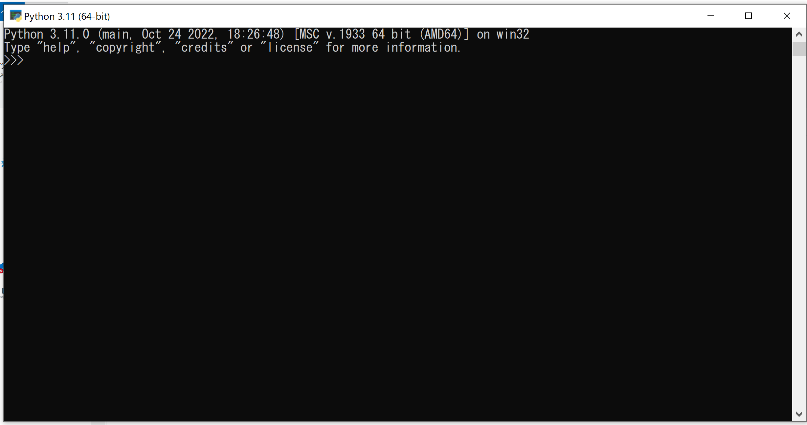

# python3講習

４S　Altair

---

# 第1回目
## 入門編

---
## 環境
* python 3.9 ,3.10 ,3.11
* ThinkPad L380 ubuntu22.04.3tls
* ThinkPad P1 Gen 3 Windows10

---
# インタープリンタの起動
通常`/usr/local/bin/python3.10`としてインストールされている

```py
pyhon3.10
```
と入力すると起動できる

```
Python 3.10.12 (main, Jun 11 2023, 05:26:28) [GCC 11.4.0] on linux
Type "help", "copyright", "credits" or "license" for more information.
>>>
```
---

Windowsの場合
  

---

プライマプロント``>>>``が出てるときにunix[ctrl]+[D],win[ctrl]+[Z]を押すとインタープリターは０を返して終了する

```py
altair@altair-ThinkPad-L380:~$ python3.10
Python 3.10.12 (main, Jun 11 2023, 05:26:28) [GCC 11.4.0] on linux
Type "help", "copyright", "credits" or "license" for more information.
>>> 
altair@altair-ThinkPad-L380:~$ 
```

```py
altair@altair-ThinkPad-L380:~$ python3
Python 3.10.12 (main, Jun 11 2023, 05:26:28) [GCC 11.4.0] on linux
Type "help", "copyright", "credits" or "license" for more information.
>>> 
```
でも可能

---
# 対話モード

```py
altair@altair-ThinkPad-L380:~$ python3
Python 3.10.12 (main, Jun 11 2023, 05:26:28) [GCC 11.4.0] on linux
Type "help", "copyright", "credits" or "license" for more information.
>>> new_world = True
>>> if new_world:
...     print("はじめ")
... 
はじめ
>>> 
```
---

コメントアウト
```py

# 1つ目のコメント
one = 1 #2つ目のコメント
# そしてこれが3つ目!
text = "# これはコメントじゃない。"

```

---

## 数値
```py

>>> 2+2
4
>>> 50-5*6
20
>>> (50-5*6)/4
5.0
>>> 8/5
1.6
>>> 17/3 #float
5.666666666666667
>>> 17//3 #切り下げ除算は小数点以下を捨て
5
>>> 17%3 #あまり
2
>>> 5*3+2
17
>>> 5**2
25
>>> 2**7
128
>>> 4*3.75-1
14.0

```

---

```py

>>> width =20
>>> height =5*9
>>> width*height
900

```
等号は代入に使う
変数は定義されないままであるとエラーが出る

```py
>>> n
Traceback (most recent call last):
  File "<stdin>", line 1, in <module>
NameError: name 'n' is not defined
>>> 

```

---


対話モードでは、最後に表示した式を変数(アンダースコア)に代入してある。

```py
>>> tax = 12.5/100 
>>> price = 100.50
>>> price * tax
12.5625
>>> price + _
113.0625
>>> round(_. 2)
113.06
```
---

## 文字列

バックスラッシュ($でクォート文字のエスケープができる 
```py
>>> 'spam eggs'# シングルクォート
'spam eggs'
>>> 'doesn\'t'# シングルクォートは\でエスケープするか...
"doesn't"
>>> "doesn't"#...ダブルクォートを使う
"doesn't"
>>> '"Yes," they said. '
'"Yes," they said.
>>> "\"Yes,\" they said."
'"Yes," they said."
>>> '"Isn\'t," they said.' 
"Isn\'t," they said.'
```
---
raw文字列
```py
>>> print('C:\some\name')# \n は改行なので
C:\some
ame
>> print(r'C:\some\name')#引用符の前のに注目
C:\some\name
```

列挙された文字列リテラル (引用符で囲まれたものたち) は自動的に連結される。
```py
>>> 'Py' 'thon" 
'Python'
```

この機能は長い文字列を分割したい時に便利
```py
>>> text = ('ながいながい文字列を' '入れておいて繋げてやろう。 ')
>>> text
ながいながい文字列を入れておいて繋げてやろう。
```
---

インデックス指定
```py
>>> word = 'Python' 
>>> word [0] # 位置 0のキャラクタ 
'P'
>>> word [5] #位置5のキャラクタ 
'n'
```
インデックスには負の数も使える。 

```py
>>> word[-1]# 最後のキャラクタ
'n'
>>> word [-2]#最後から2番目のキャラクタ
'o'
>>> word [0:2]#０から２（含まない）まで
'Py'
```
---
## リスト
pythonには複合したデータのための型がいくつかあり，他の種類の値をまとめるのに使える

```py
>>> squares=[1,4,9,16,25]
>>> squares 
[1,4,9,16,25]
```
文字列同様にインデックス操作，スライス操作ができる

```py
>>> squares[0]
1
>>> squares[-1]
25
>>> squares[-3:]
[9,16,25]
>>> squares[:]
[1,4,9,16,25]
```
---
文字列はimmutableだがリストはmutable

```py
>>>cubes=[1,8,27,65,125]
>>>4**3
64
>>>cubes[3]=64
>>>cubes
[1,8,27,64,125]
>>>cubes.append(216)
>>>cubes.append(7**3)
>>>cubes
[1,8,27,64,125,216,343]
```

---
# Python 3の制御構文: while, if, for

---

## while文
while 条件:
 条件がTrueの間、このブロックが繰り返し実行されます
 条件がFalseになるとループが終了します

- `条件`がTrueの間、ループが続行
- `break`文で強制的にループを終了
- `continue`文でループを再開

---

## if文
if 条件:
 条件がTrueの場合、このブロックが実行されます
elif 別の条件:
 別の条件がTrueの場合、このブロックが実行されます
else:
 どの条件もTrueでない場合、このブロックが実行されます

- 条件に応じて異なるコードブロックを実行

---

## for文

for 要素 in イテラブル:
 イテラブルから要素を1つずつ取り出し、このブロックが実行されます

- イテラブルはリスト、タプル、文字列、辞書など
- `range()`関数を使用して繰り返し範囲を生成することもできる

---

## 例: while文
```py
count = 0
while count < 5:
 print(count)
 count += 1
```

- 0から4までの数字を表示します
- `count`が5未満の間、ループが続行

---

## 例: if文
```py
score = 85
if score >= 90:
print("優秀")
elif score >= 70:
print("良い")
else:
print("普通")
```
- `score`に応じて異なる評価を表示
---

## 例: for文
```py
fruits = ["りんご", "バナナ", "オレンジ"]
for fruit in fruits:
print(fruit)
```
- リスト内の各要素を表示

---


- `while`文は条件がTrueの間、繰り返し実行
- `if`文は条件に応じて異なるコードブロックを実行
- `for`文はイテラブル内の要素を繰り返し処理

---
## ではプログラムを書いてみよう
フィボナッチ数列を羅列させる　最大値10
```python
0
1
1
2
3
5
8
```
---
ヒント
- while文
- print()
- a, b = b, a + b

---
答え
```python
>>>a, b = 0, 1  # aに0を代入し、bに1を代入
>>>while a < 10:  # aが10未満の間、以下の処理を繰り返す
...    print(a)  # aの値を表示
...    a, b = b, a + b  # aにbの値を代入し、bにはaとbの合計を代入
0
1
1
2
3
5
8

```
whileはaが10未満の間、以下のコードブロックを繰り返すループを定義している。

---
工夫してみる
出力末端の改行の抑制
```python
>>>a, b = 0, 1  # aに0を代入し、bに1を代入
>>>while a < 10:  # aが10未満の間、以下の処理を繰り返す
...    print(a,end=',')  # aの値を表示
...    a, b = b, a + b  # aにbの値を代入し、bにはaとbの合計を代入
0,1,1,2,3,5,8
```
見やすくなった

---
次回
制御構造ツール

