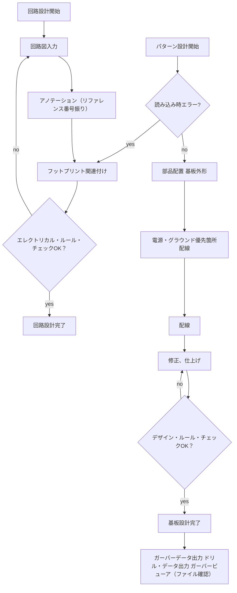

# **回路講習**

GitHub:Altairu

X: ＠Flying___eagle

---

### 開発環境
- KiCad 7.0
- Ubuntu22.04

# KiCadの全体構成

kicadに含まれるプログラムと機能

### 設計フロー
 - 手順1　回路図を作成する
 - 手順2　基板レイアウト（PCB）を作成する
 - 手順3　ガーバデータ、ドリルデータを出力する
  
これらの手順により回路を設計する。

設計フロー図

補足
>kiCadにはFreeRoutionという自動配線ツールを使用することができる

# KiCadの起動と新規プロジェクトの作成

左上の[ファイル]から[新規プロジェクト]を選択肢作成する
ここではファイル名を[hoge00]とする

すると以下のようにファイルが2つ作成される

それでは早速回路を設計していく

# ステップ１：回路図入力

[hoge00.kicad_sch]をダブルクリックして開く。

すると回路図エディタが開かれる

以下の手順で無安定マルチバイブレータを作成していく
- 手順１：部品の配置
- 手順２：配線をおこなう
- 手順３：文字の編集
- 手順４：リファレンス記号に番号をつける
- 手順５：フットプリントの関連付け
- 手順６：ERC実行

## 手順１：部品の配置
回路で使用する部品を配置していく

回路図エディタの右側のツール・バーの上から3 番目に表示されている「シンボルを配置」を選択した状態で、画面の適当な場所でクリックすると、 シンボルを選択」のウィンドウが現れる。「My_ Device」の中にある2SC1815をダブルクリックする

カーソルに2SC1815のシンボルが表示されるので、位置を決めて配置する、クリックすると配置される

ベースが向かい合うようにして、もう1つの2SC1815を配置する。
シンボルを選択した状態で右クリックを押すとメニューバーが出てくる。そこで水平反転を選択し、向きをベースが向かい合うようにする

配置場所を修正するには、部品の上にカーソル を置いてキーボードの [M] キーを押す 
コンデンサ[C_Polarized]を選んで配置する.
シンボルは選択して [Ctrl＋C] キーを 押すと、コピーして [Ctrl＋V] キーで貼り付けができる。また、 [R] キーで回転する。

同じように、抵抗とLEDを配置する、抵抗はR, LEDはLEDを使う

コネクタを配置する。「Connector_Generic」の 中にある [Conn_01x02]を使う

## 手順２：配線をおこなう

ワイヤーを追加を選択し、部品同士を配線する。

[ESC]キーで取り消し、[Ctrl+Z]キーで一つ前に戻れる。

右側のアイコンを押すことで斜めに配線可能になったりする。

## 手順３：文字の編集
## 手順４：リファレンス記号に番号をつける
## 手順５：フットプリントの関連付け
## 手順６：ERC実行