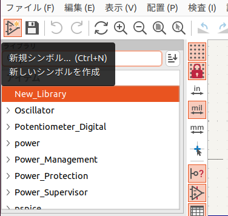
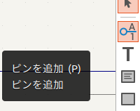
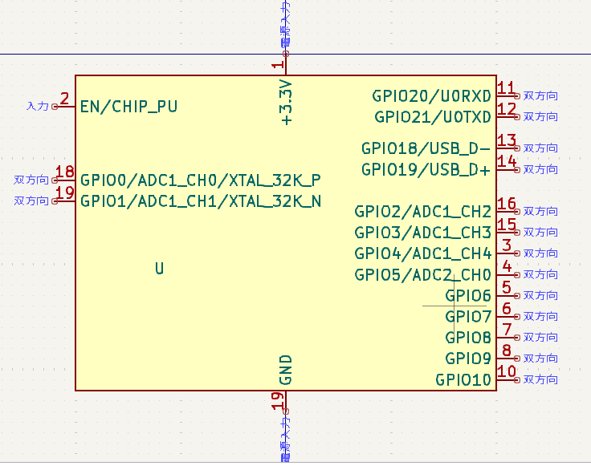
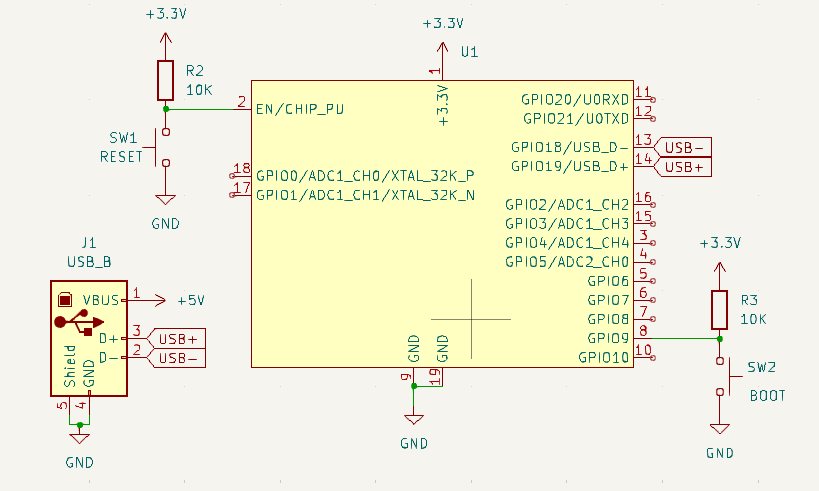
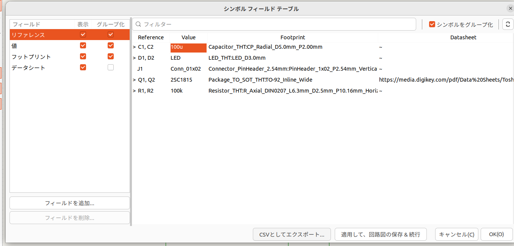
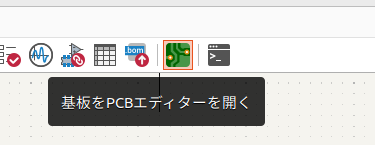
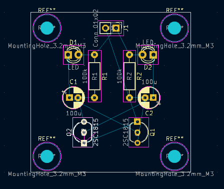
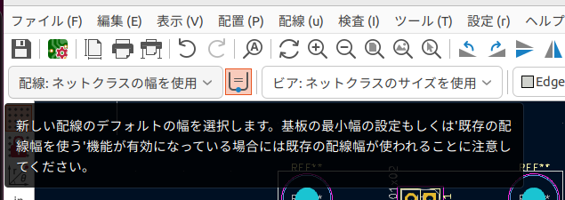
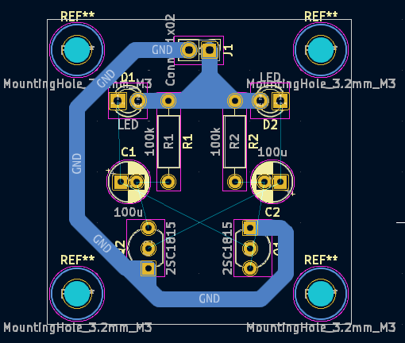
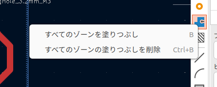

# **回路講習** -KiCad編-

GitHub:Altairu

X: ＠Flying___eagle

---

### 開発環境
- KiCad 7.0
- Ubuntu22.04

# KiCadの全体構成

kicadに含まれるプログラムと機能

### 設計フロー
 - 手順1　回路図を作成する
 - 手順2　基板レイアウト（PCB）を作成する
 - 手順3　ガーバデータ、ドリルデータを出力する
  
これらの手順により回路を設計する。

設計フロー図

補足
>kiCadにはFreeRoutionという自動配線ツールを使用することができる

# KiCadの起動と新規プロジェクトの作成

左上の[ファイル]から[新規プロジェクト]を選択肢作成する
ここではファイル名を[hoge00]とする

すると以下のようにファイルが2つ作成される

それでは早速回路を設計していく

# ステップ１：回路図入力

[hoge00.kicad_sch]をダブルクリックして開く。

すると回路図エディタが開かれる

以下の手順で無安定マルチバイブレータを作成していく
- 手順１：部品の配置
- 手順２：配線をおこなう
- 手順３：文字の編集
- 手順４：リファレンス記号に番号をつける
- 手順５：フットプリントの関連付け
- 手順６：ERC実行

## 手順１：部品の配置
回路で使用する部品を配置していく

回路図エディタの右側のツール・バーの上から3 番目に表示されている「シンボルを配置」を選択した状態で、画面の適当な場所でクリックすると、 シンボルを選択」のウィンドウが現れる。2SC1815を入力しOKを押す。

カーソルに2SC1815のシンボルが表示されるので、位置を決めて配置する、クリックすると配置される

ベースが向かい合うようにして、もう1つの2SC1815を配置する。
シンボルを選択した状態で右クリックを押すとメニューバーが出てくる。そこで水平反転を選択し、向きをベースが向かい合うようにする

配置場所を修正するには、部品の上にカーソル を置いてキーボードの [M] キーを押す 
コンデンサ[C_Polarized]を選んで配置する.
シンボルは選択して [Ctrl＋C] キーを 押すと、コピーして [Ctrl＋V] キーで貼り付けができる。また、 [R] キーで回転する。

同じように、抵抗とLEDを配置する、抵抗はR, LEDはLEDを使う

コネクタを配置する。「Connector_Generic」の 中にある [Conn_01x02]を使う

## 手順２：配線をおこなう

ワイヤーを追加を選択し、部品同士を配線する。

[ESC]キーで取り消し、[Ctrl+Z]キーで一つ前に戻れる。

右側のアイコンを押すことで斜めに配線可能になったりする。

電源シンボルを追加する

## 手順３：文字の編集
C_Polarizedなどの名前を変更する。

## 手順４：リファレンス記号に番号をつける
リファレンス記号に番号をつける。
アノテーションを押し番号をつける。

## 手順５：フットプリントの関連付け
すべての部品にフットプリントを割り当てる必要がある。

Package_TO_SOT_THT:TO-92_Inline以外がフットプリンが割り当てられていない。

では以下のように設定する。

最初から2SC1815にはPackage_TO_SOT_THT:TO-92_Inlineが割り当てられているが間隔が狭いためはんだ付けが難しい

そこでPackage_TO_SOT_THT:TO-92_Inline_Wideを使用するとよい

## 手順６：ERC実行
ercは未配線箇所や出力ピン同士の出力などの確認を自動でおこなう機能。

しかし、問題ない回路であってもエラーや警告が表示されることがある。
この場合のエラーは無視できる。

>補足
いかよりCSVでエクスポートすると部品図一覧をエクセルで開くことができる。

# ステップ２：パターン設計（PCB）

すると，以下のような画面が開く．
ここで配線図を作成する

  

## 手順１：部品を持ってくる

回路図で設定したからフットプリントを持ってくる

基盤を更新．すると以下のような部品が出現．
これがフットプリントである．

## 手順２：配置，穴，外形を決める

次に回路全体の大きさを決める．

その前にピッチを変える
以下でPCBの点の間隔を変更できる

今回は１．２７をしようする．

レイヤーは回路の階層ごとに使用する．

* f.cu:表面
* b.cu:ウラ面
* edge.cuts:外形

まずは外形を決める
レイヤーを[edge.cuts]を選択し，四角のモードを選択．

そして以下のように外形を描く

今回は38.1[mm]×38.1[mm]とする．

次に穴を決めていく

穴のフットプリントを使用する．
“MountingHole”ライブラリの“MountingHole_3.2mm_M3”フットプリントを使う

部品を美しく並べていく
配線がしやすくなるように並べる．

## 手順３：電源，グランド配線

主要である電源とグランドの配線を行う．
配線するときの線の太さは以下に種類を追加できる．
予め設定しておこう．

電源はできるだけ太くする必要がある．
また，切削基盤のため今回はウラ面に配線する．
レイヤーを裏側に設定する

それでは配線していく
2mmで配線した．

## 手順４：配線

では他の配線も行う．
切削基盤の場合，線の幅を1.5mm以上にすることをおすすめする．

配線中にかぶってしまって配線できないことがある．そんなときは表配線を使用する．

貫通ビアを配置を選択

するとこのようにまたぐことができる．

完成．
少し汚いが，これで良しとしよう．．．

ではベタグラウンドについて説明する．
一番負荷がかかるGNDを大きくしたり，ノイズの影響を受けにくくしたりと便利なのでとりあえずしときましょう．

塗り潰しゾーンを選択．

回路の左上端をクリックして以下のように設定する．
- B.cuを選択
- GNDを選択
- 実線を選択

そして四角の端を全て選択すると

そして塗りつぶしを行う．

とりあえずこれで完成．

## 手順5：デザインルールチェック

Kicadには回路チェックの機能があるのでそれを使用して，配線わすれなどがないか確認する．

警告よりもエラーを主に見る．
今回はエラーはなかった．

警告文はシルク（表面の文字とか）なので，今回は切削基盤のため無視してOK．

これにて回路完成です．
