 

 
 
 

# **回路講習１**
 

　Altairu

　＠Flying___eagle

---
## **抵抗器**

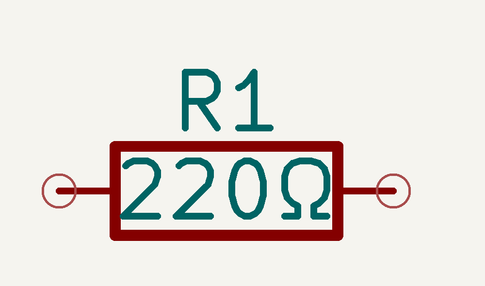  

最も基本的な素子．単位はオーム[Ω]
* 電流の大きさを制限
* 電流を電圧に変換することも

---

### 種類
 

- ☆炭素被膜抵抗　　一般的なリード抵抗
 
- ☆メタルグレース抵抗　　一般的なチップ抵抗
 
- 金属皮膜抵抗　　精度・安定性よし
 
- 酸化金属皮膜抵抗　　耐電力大

---
## **カラーコードの読み方**

| カラー | 数値 | 乗数 | 誤差 |
| ------ | ---- | ---- | ---- |
| 黒     | 0    | 10^0 | -    |
| 茶     | 1    | 10^1 | ±1%  |
| 赤     | 2    | 10^2 | ±2%  |
| 橙     | 3    | 10^3 | -    |
| 黄     | 4    | 10^4 | -    |
| 緑     | 5    | 10^5 | ±0.5%|

---
## **カラーコードの読み方**
| カラー | 数値 | 乗数 | 誤差 |
| ------ | ---- | ---- | ---- |
| 青     | 6    | 10^6 | ±0.25%|
| 紫     | 7    | 10^7 | ±0.1% |
| 灰     | 8    | 10^8 | ±0.05%|
| 白     | 9    | 10^9 | -    |
| 金     | -    | 10^-1| ±5%  |
| 銀     | -    | 10^-2| ±10% |

---

## **コンデンサ**

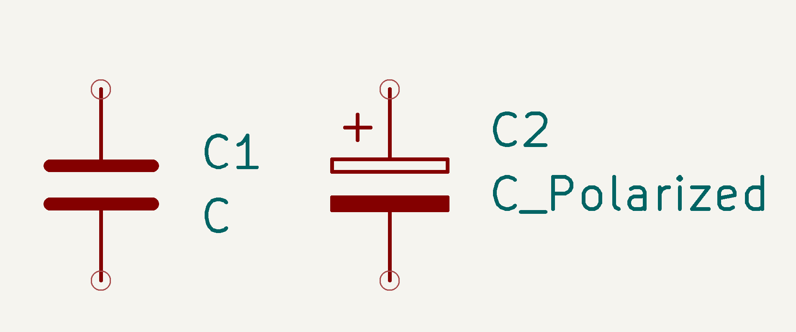  

電荷を蓄える素子．単位はファラド[F]
* 交流信号の通過を許可
* 電圧の安定化やフィルタとして使用

---

### 種類
 

- ☆セラミックコンデンサ　　小型で高周波特性に優れる
 
- ☆電解コンデンサ　　大容量で極性がある
 
- フィルムコンデンサ　　中高電圧での使用に適する

---

## **ダイオード**
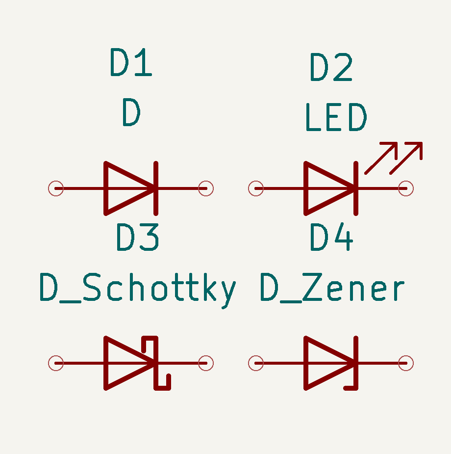  
 

 
一方向にのみ電流を流す素子
 
 

* 順方向電圧降下がある 
(シリコン: 約0.7V)

* 整流や電圧保護に使用

---

### 種類
 

- シリコンダイオード　　一般的な用途
 
- ショットキーバリアダイオード　　スイッチング特性が早い
 
- ゼナーダイオード　　電圧リファレンスとして使用
 
- LED (発光ダイオード)　　光を放出する

---

## **トランジスタ，FET**
   

 
電流を増幅する素子
 

* ベース,エミッタ,コレクタ
（トランジスタ）
* ゲート,ソース,ドレイン
（FET）
* 増幅回路やスイッチとして使用

---

### 種類
 

- バイポーラトランジスタ (BJT)　　
NPNとPNPタイプ
 
- フィールド効果トランジスタ (FET)　　
電界効果を利用 (例: MOSFET)
---

## **フォトカプラ**
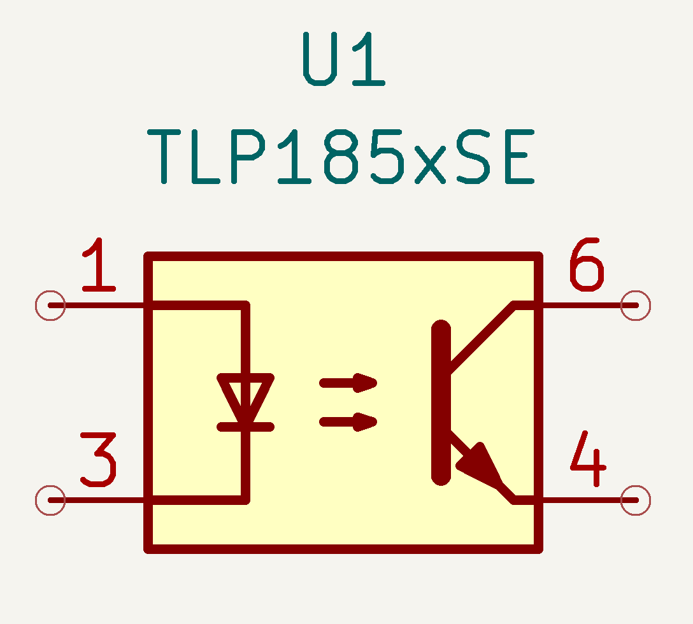  

 
光を使い信号を伝達する絶縁デバイス
 
 
 

一次側の発光素子から
二次側のフォトトランジスタへ
信号伝達

---
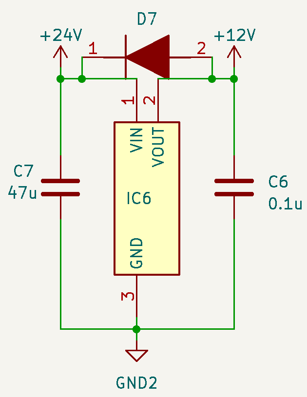 
## **三端子レギュレーター** 

* 降圧素子

* 端子が3つ
(入力・グラウンド・出力）

* 三端子レギュレータは落とした分の電圧をすべて`熱`として消費

---
## **論理回路**
論理回路は、デジタル信号を扱う回路で、0と1の二つの状態を持つ信号を処理します。
**基本的な論理ゲート**
 ANDゲート
 ORゲート
 NOTゲート
 NANDゲート
 NORゲート
 XORゲート
 XNORゲート

---

## **基本論理ゲートの動作**

- ANDゲート
-> 入力が全て1の時のみ出力が1

- ORゲート
-> 入力のどれかが1の時出力が1

- NOTゲート
-> 入力が0の時出力が1、入力が1の時出力が0

- NANDゲート
-> ANDゲートの出力を反転

---

- NORゲート
-> ORゲートの出力を反転

- XORゲート
-> 入力が異なる時出力が

- XNORゲート
-> XORゲートの出力を反転

---

## **論理ゲートの真理値表**

| A | B | AND | OR | NOT A | NAND | NOR | XOR | XNOR |
|---|---|-----|----|-------|------|-----|-----|------|
| 0 | 0 |  0  |  0 |   1   |  1   |  1  |  0  |   1  |
| 0 | 1 |  0  |  1 |   1   |  1   |  0  |  1  |   0  |
| 1 | 0 |  0  |  1 |   0   |  1   |  0  |  1  |   0  |
| 1 | 1 |  1  |  1 |   0   |  0   |  0  |  0  |   1  |

---

## **74HCxxシリーズ**

74HCxxシリーズは、高速CMOSロジックICで、一般的な論理回路を実装するためのものです。

### **主なIC**
- 74HC00: 4つの2入力NANDゲート
- 74HC02: 4つの2入力NORゲート
- 74HC04: 6つのインバータ（NOTゲート）
- 74HC08: 4つの2入力ANDゲート
- 74HC32: 4つの2入力ORゲート

---

## **74HC00のピン配置と機能**
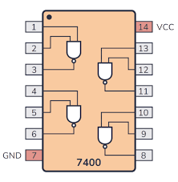  

### ピン配置
- Vcc: 電源
- GND: 接地
- 各入力と出力ピンが4つのNANDゲートに対応

---
 
 
 
 

# **実際にロボコンで使われている回路を見てみよう**

---
# モタドラとは
 

## **マイコンなどの制御部からの指示を受けてモーターを駆動、制御するためのデバイス**

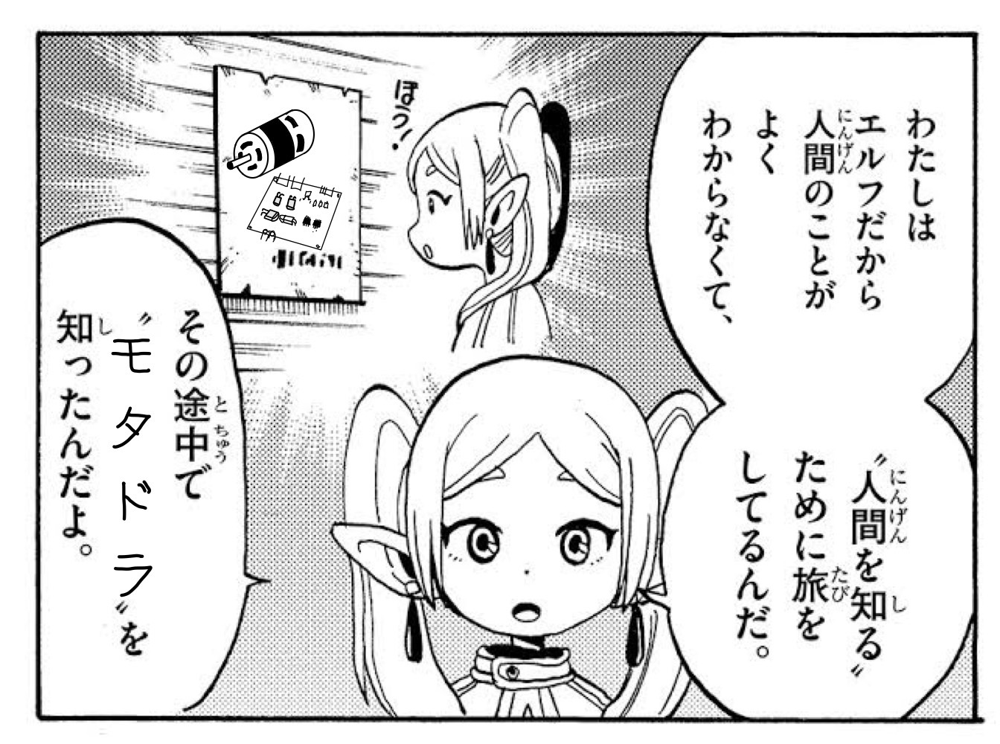　

---
### **AltairMD_V7**
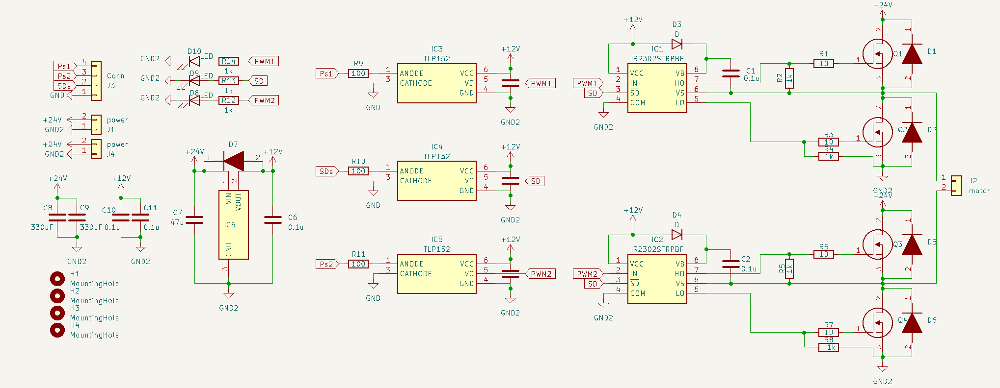

---
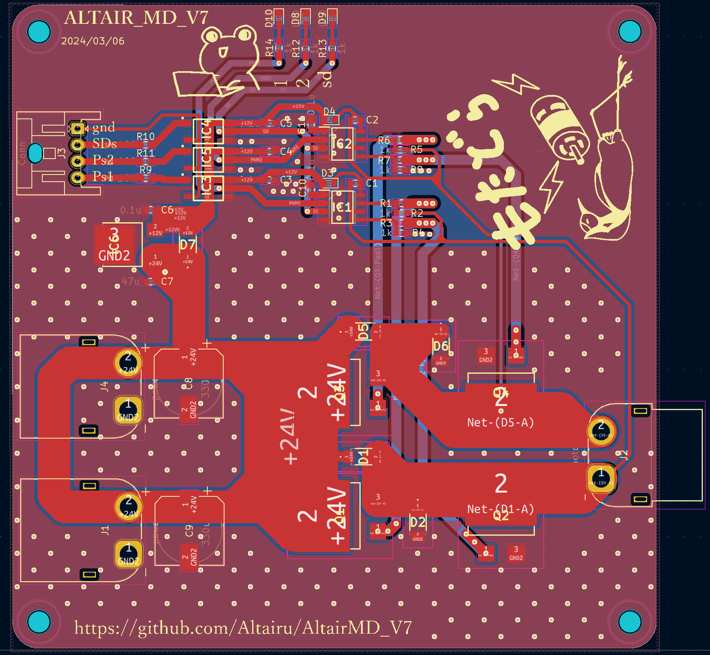
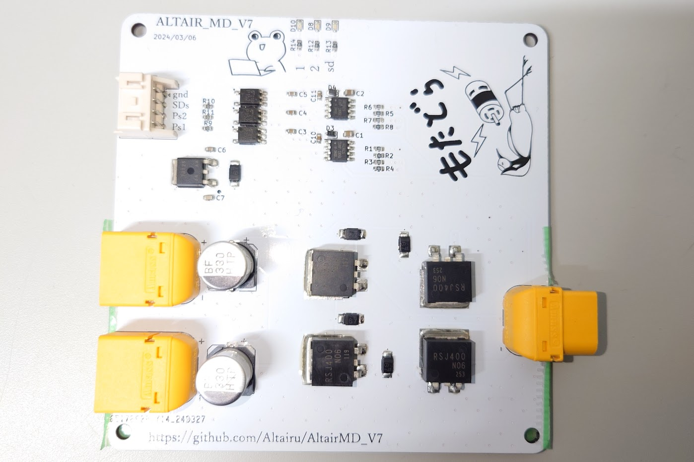

---
### **仕様**
* 30V~10V(フォトカプラを変更すると10V以下も可)
* 最大40A 

|SDs|Ps1|Ps2|出力|
|:----:|:----:|:----:|:----:|
|HIGH|LOW	|LOW	|停止|
|HIGH|LOW	|HIGH	|逆転|
|HIGH|HIGH	|LOW	|正転|
|HIGH|HIGH	|HIGH	|`ブレーキ`（非推奨）|
|LOW|X	|X	|0|

---
### **降圧**
 
### **三端子レギュレーター** 
### **[NJM7812SDL1]()**
* **12Vに降圧**
* **端子が3つ(入力・グラウンド・出力）**
* **三端子レギュレータは落とした分の電圧をすべて`熱`として消費**

---
### **降圧**
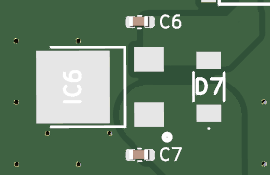 

* **ダイオード**
レギュレータに逆電流が流れるのを防止

* **コンデンサ**
コンデンサは入力側と出力側に0.1～10[uF]程度入れるのが一般的

**データシートを読もう！**

---
## **フォトカプラ**
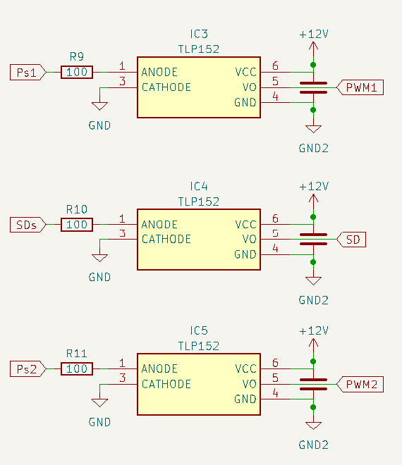

### [TLP152](https://akizukidenshi.com/catalog/g/g110824/)
* 電源電圧min.：10V
* 電源電圧max.：30V
* 出力電流：2A
* 入力電流max.：20mA
* 上昇応答時間：95ns
* 下降応答時間：110ns

---
## **MOSFET**
[**RSJ400N10**](https://www.rohm.co.jp/products/mosfets/small-signal/single-nch/rsj400n10-product)
Nch 100V 40A Power MOSFET
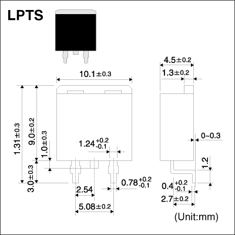
* 4V駆動タイプ
* Nチャンネル　パワーMOSFET
* 高速スイッチング
* 駆動回路が簡単
* 並列使用が容易

ゲート抵抗は10[Ω]で設定している

---
### **ハーフブリッジゲートドライバ**
### [**IR2302STRPBF**](https://akizukidenshi.com/catalog/g/g115656/)
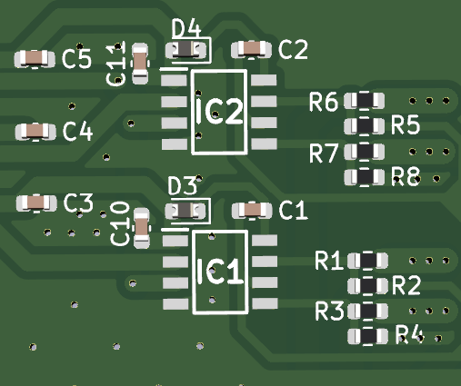 
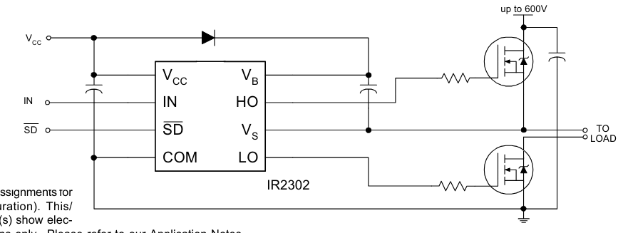 

---
### [**IR2302STRPBF**](https://akizukidenshi.com/catalog/g/g115656/)
 
* IN端子
ハイサイドMOSFETをONにするか、ローサイドMOSFETをONにするかの切り替えを行う
Hが入力されるとハイサイド、Lが入力されるとローサイドがONとなる

---
### [**IR2302STRPBF**](https://akizukidenshi.com/catalog/g/g115656/)
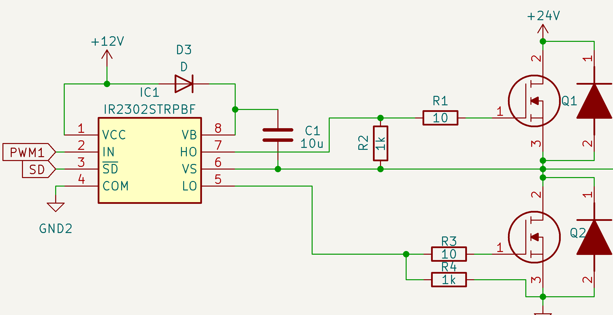 

**ハイサイドにNchMOSFETを使うためにブーストラップ回路を使用**
* ブートストラップコンデンサの容量は[10uF]
* ブートストラップダイオード
(ファストリカバリダイオード)
* `100％出力は不可`
ブートストラップ回路の制約で
コンデンサのチャージ時間が必要.

---

# Ｈブリッジ回路
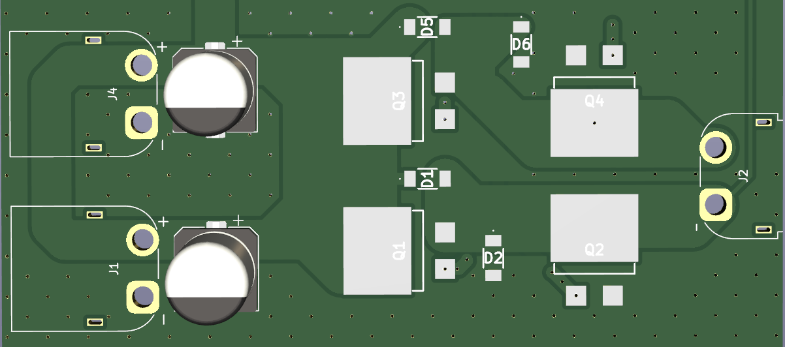 

---
 
 

| Ps1 | Ps2 | Q1  | Q2  | Q3  | Q4  | 1    | 2    | 
| :----: | :----: | :----: | :----: | :----: | :----: | :----: | :----: | 
| L   | L   | H   | L   | H   | L   | open | open | 
| L   | H   | H   | H   | L   | L   | L    | H    | 
| H   | L   | L   | L   | H   | H   | H    | L    | 
| H   | H   | H   | H   | H   | H   | L    | L    | 

---

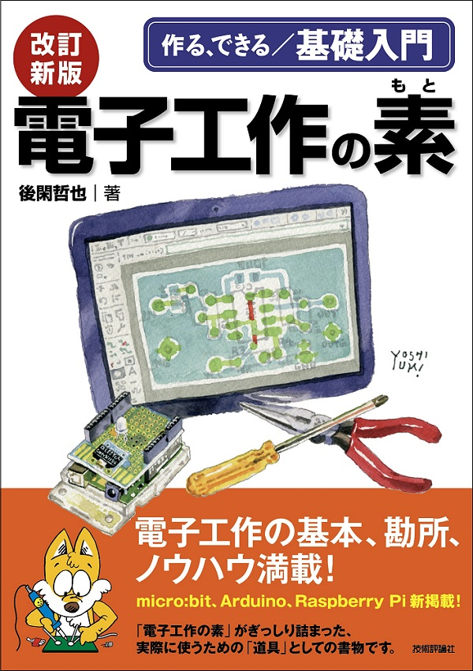

 
 
 

# 電子工作の素を読もう

ここに回路のすべてが⁉

---
### とりあえず`KiCad`は入れときましょう
回路図エディタとPCB設計するための統合開発環境
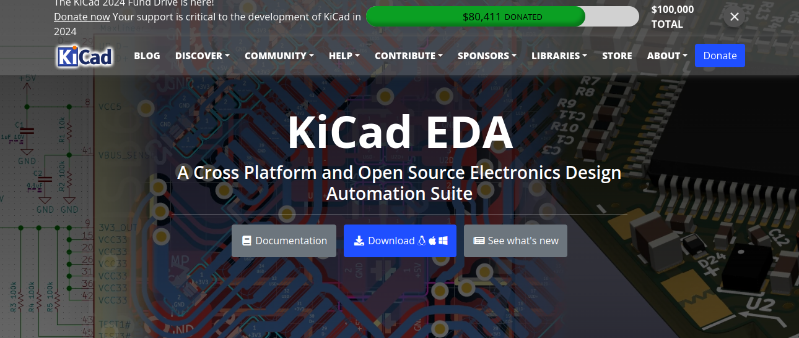 

---
### できれば`FlatCAM`も
G-code作るソフト
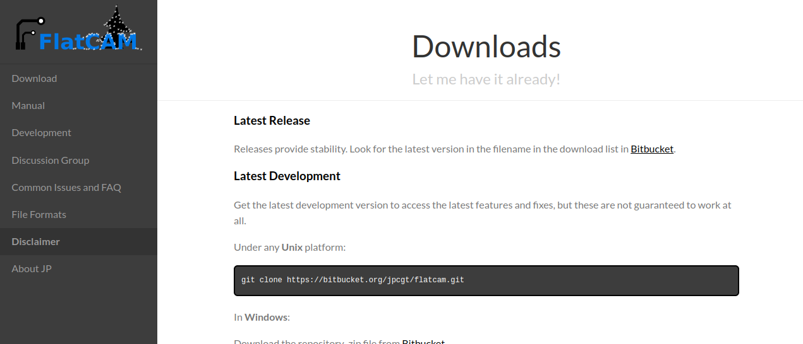

---
 
 
 

# 実際に設計してみましょう!