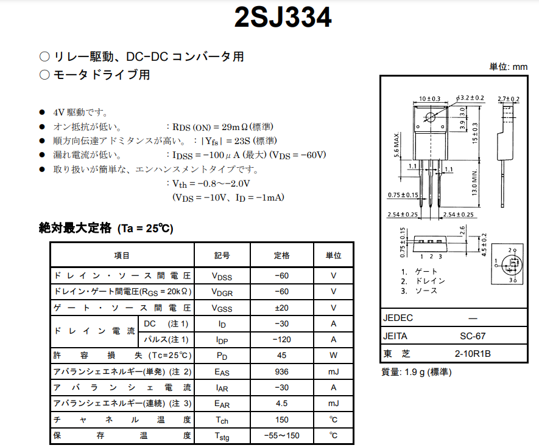
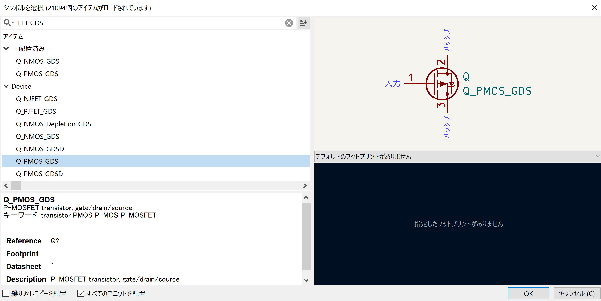
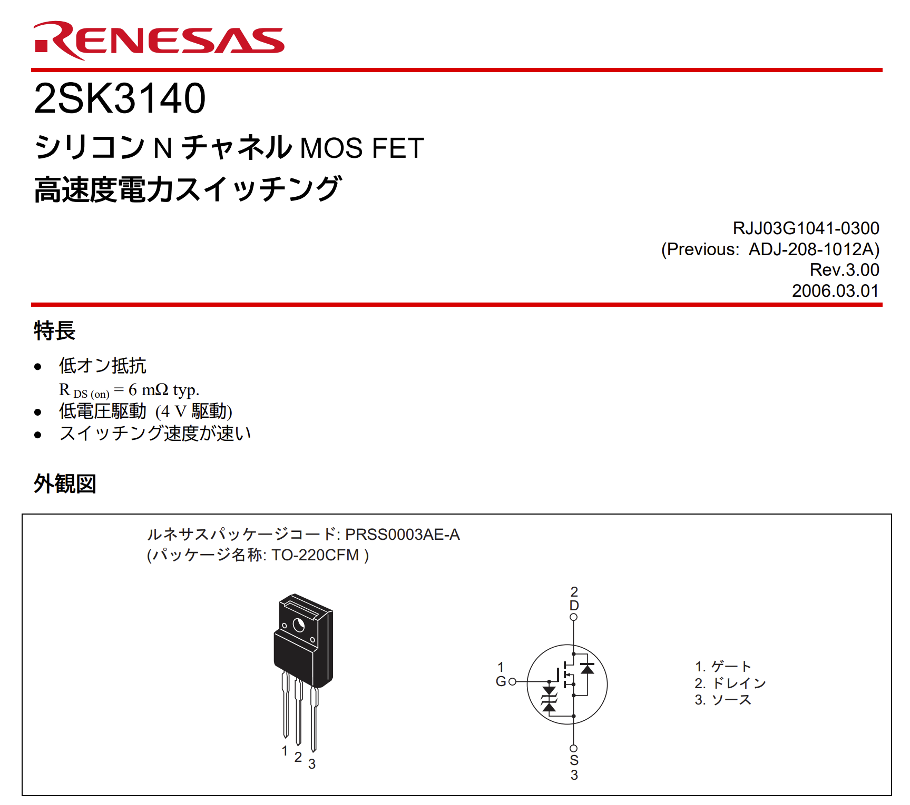
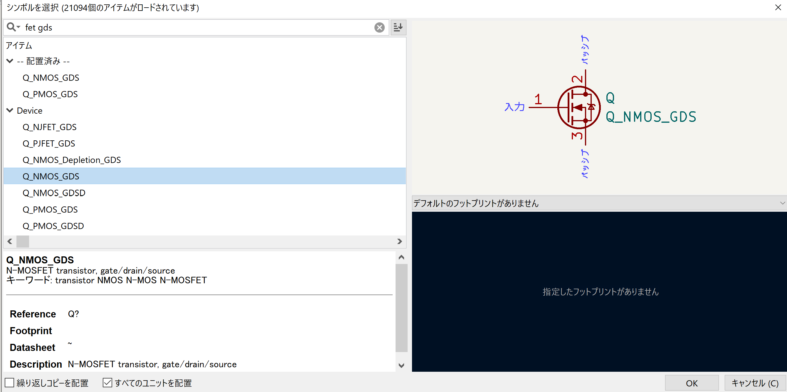
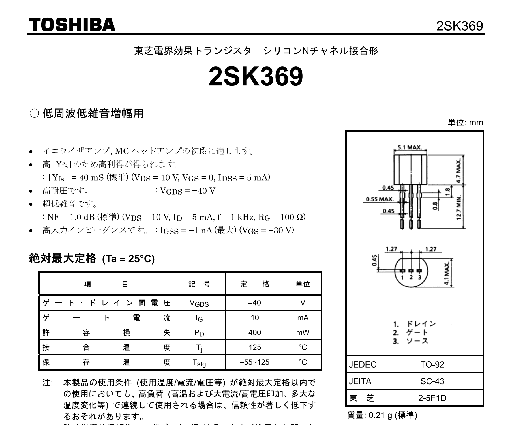
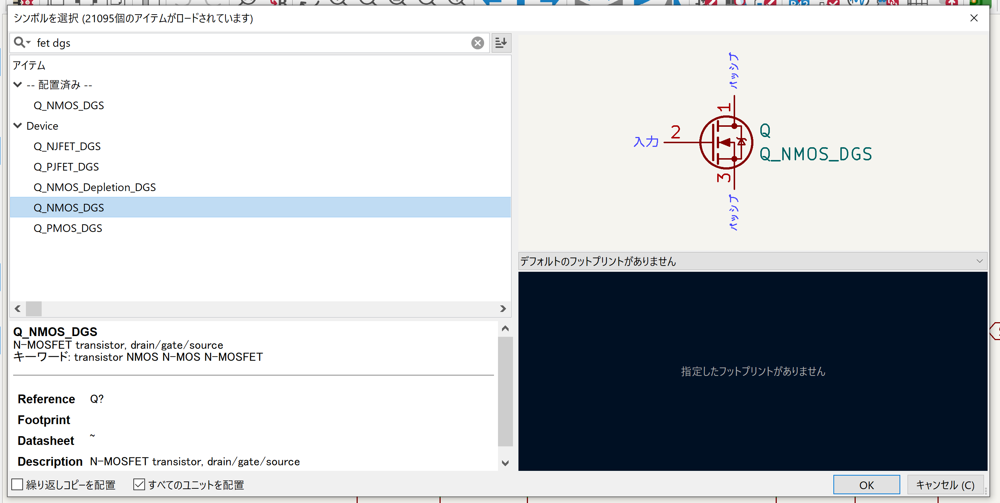
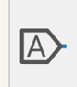
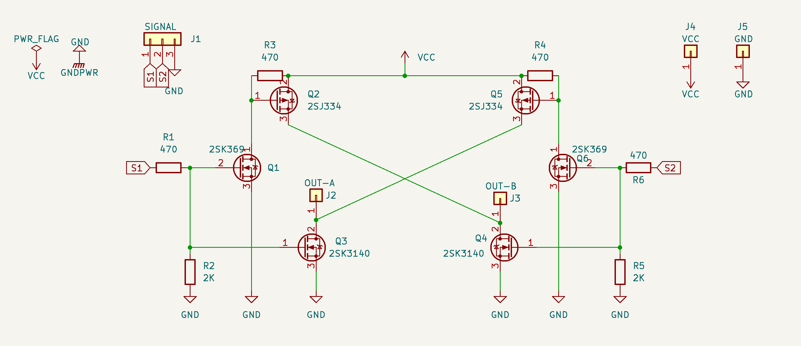
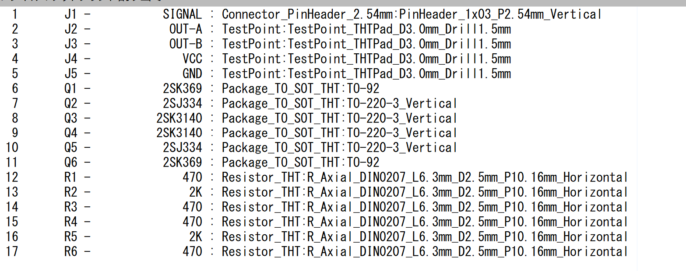

 

 
 
 

# **回路講習2**
 

　Altairu

　＠Flying___eagle

---
 

# **Hブリッジ回路を作る**

Hブリッジ回路はＤＣモータの制御を行う回路
ＤＣモーターを正転逆転させることができます

今回はAltairMD_V7と違いPN混合のHブリッジを作成していきます．

---
# 部品一覧
* PチャネルMOS　2SJ334
* NチャネルMOS　2Sk3140
* シリコンNチャネル　2SK369
* 抵抗：普通のＲ、６個
* 端子：Ｃｏｎｎ＿０１ｘ０１、４個
* ３ピンヘッダ：Ｃｏｎｎ＿０１ｘ０３、１個
* ＶＣＣ, ＧＮＤ, ＰＷＲ＿ＦＬＡＧ, ＧＮＤＰＷＲ

---
### **PchパワーMOSFET 60V30A 2SJ334**

  

### ポイント

- PチャネルMOS型

- GDSの順 
1.ゲート2.ソース3.ドレイン

-  JEITA:SC-67 -> TO-220SIS

---
### シンボル選択

２ＳＪ３３４は、ＦＥＴ Ｐチャンネル ピン配置がＧＤＳ

のものを選択する

[FET GDS]と検索

---

  

---
### **NchパワーMOSFET 60V60A 2SK3140**

  

### ポイント
- NチャネルMOS型

- GDSの順 
1.ゲート2.ソース3.ドレイン

-  TO-220CFM

---
### シンボル選択
２ＳＫ３１４０は、ＦＥＴ Ｎチャンネル ピン配置がＧＤＳ
のものを選択する

[FET GDS]と検索

---

  

---
### **シリコンNチャネル　2SK369**

  

### ポイント
- シリコンNチャネル

- DGSの順 
1.ドレイン2.ゲート3.ソース

-  TO-220CFM

---
### シンボル選択

２ＳＫ３６９は，ＦＥＴ，Ｎチャンネル，ピン配置がＧＤＳ
のものを選択する

[FET DGS]と検索

---
  

---
### その他の部品 
- 素子関連
    - 抵抗：普通のＲ、６個
    - 端子：Ｃｏｎｎ＿０１ｘ０１、４個
    - ３ピンヘッダ：Ｃｏｎｎ＿０１ｘ０３、１個

- 電源関連
    - ＶＣＣ
    - ＧＮＤ
    - ＰＷＲ＿ＦＬＡＧ
    - ＧＮＤＰＷＲ

---
### ラベルの使い方

  

グローバルラベルを追加を選択．

そして名前を付けてOK

  

---

  

---

# **PCBをやろう！**

