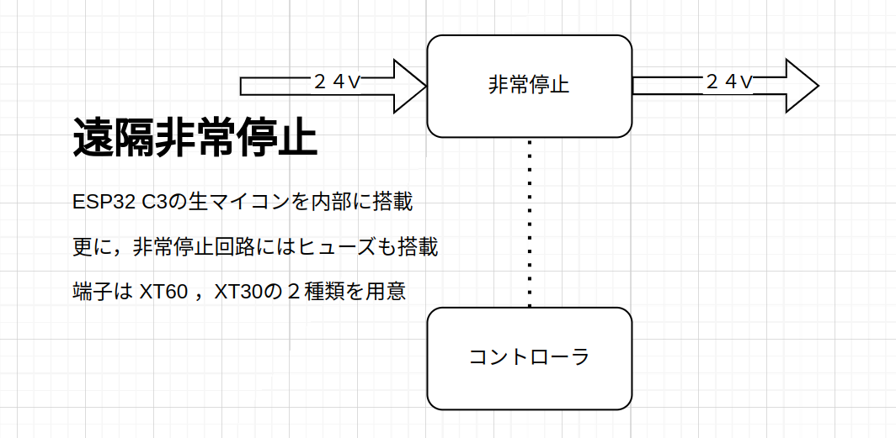
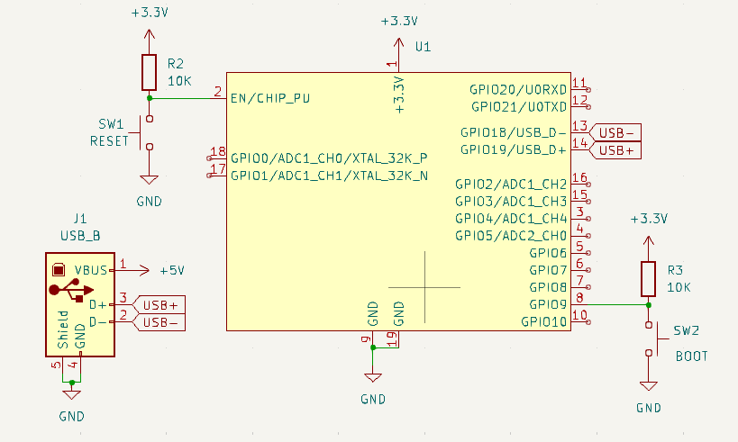
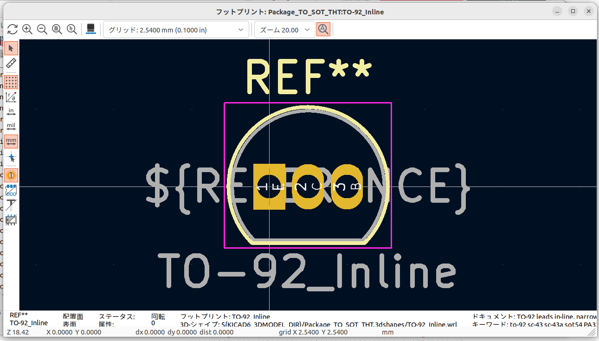

 

 
 
 

# **回路講習3**
 

　Altairu

　＠Flying___eagle

---
# 仕様から回路を作る

回路を作るときどのような機能を乗せるかという仕様を最初に決めます．

そこから部品を選定し（データシートを読んで），回路を作成していく．

この流れを皆さんにやっていただく．

---
## お題：遠隔非常停止

# **一番良かった人のを実際に採用．**
# **１０枚即発注．**
# **命名権あり**

---
## お題：遠隔非常停止

---
# 注意点

- 素子は部室にあるもの（主にモータードライバーで使用したもの）
- 回路の大きさは小さければ小さいほど良い
- 電流は最低40A以上耐久（線は太くってこと）
- 24Vから3.3Vの降圧を３端子レギュレーターで行うと熱くなるのでやめましょう．
- マイコンはESP32 C3を使用せよ
（回路講習０で作ったシンボル，フットプリントを用いる．）

---
## ESP32 C3の基本回路

---

