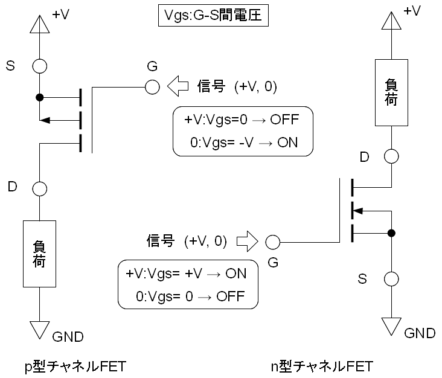
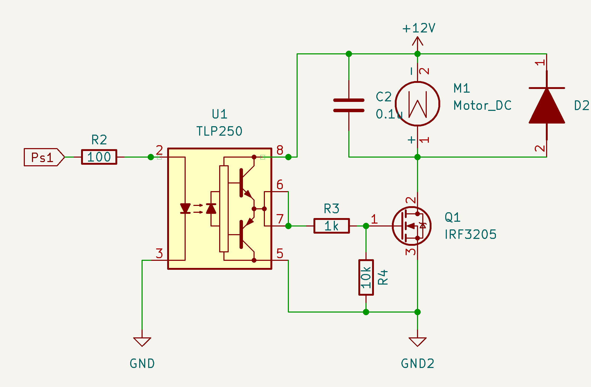
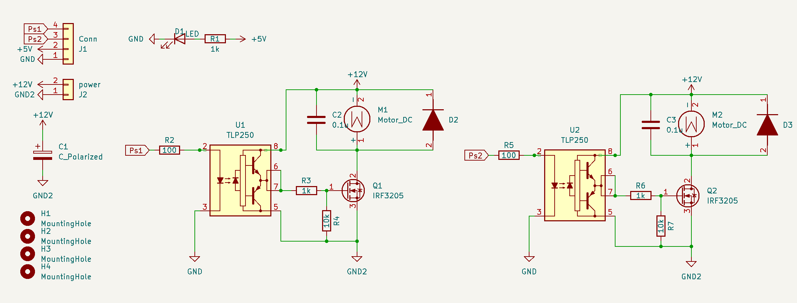
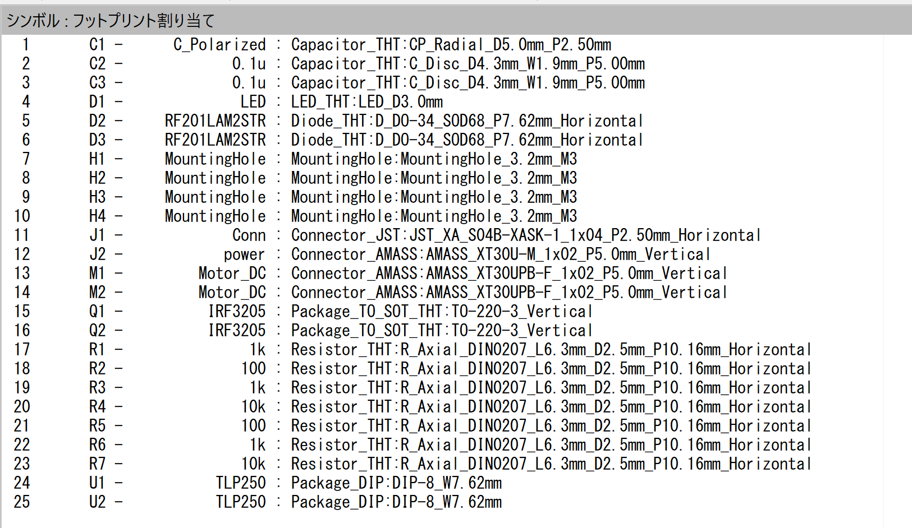
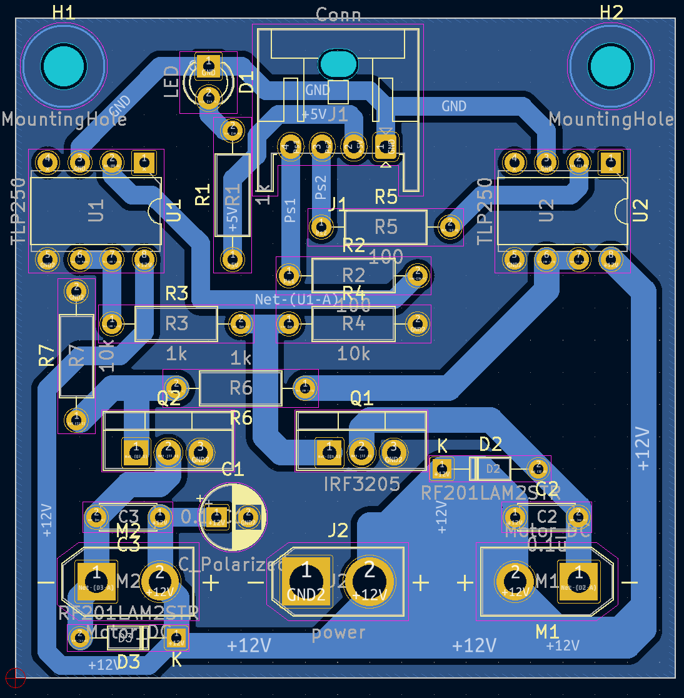

 

 
 
 

# **回路講習3**
 

　Altairu

　＠Flying___eagle

---
### **モーターを回してみる**
 

**N-CH MOSFETを使って**
**モーターを単方向に回す**
**回路を作ってみよう．**

  

---
### KiCadで作ってみよう

- フォトカプラ　
  - TLP250

- MOSFET
  - IRF3205

逆起電力防止用ダイオード
ノイズ除去コンデンサ

  

---
### 以下の使用のものを作れ
モーターを単方向に二つ動かす回路マイコンにより制御されマイコンと駆動部のGNDを絶縁すること

マイコン信号:Conn_01x04（Ps1,Ps2,+5V,GND）

電源入力:Conn_01x02(+12V,GND2)

電源にバイパスコンデンサ:C_Polarized

---

  

---

  

---  
  
